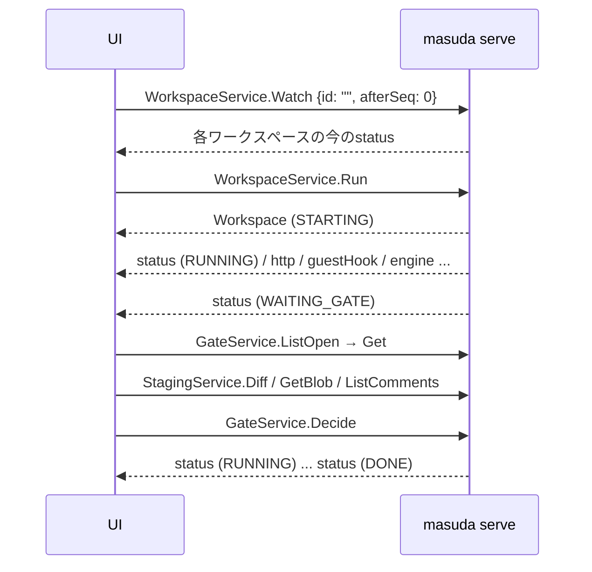

# 典型的な流れ

GUIを組むときの、RPCの呼び方の順と、返ってきたものの読み方。例はHTTP+JSONの形で書く（TypeScriptのクライアントでもフィールド名は同じ）。各RPCの意味は[サービスとRPC](services.md)、失敗のコードは[エラーコード](errors.md)にある。

## 全体の形



GUIは`Watch`を1本開いたままにし、`status`イベントで画面を更新する。ゲートや質問の中身は、状態が変わったときにGateService・QuestionServiceから取る。ポーリングは要らない。

## ワークスペースの起動と`Watch` {#watch}

### 起動

```http
POST /masuda.api.v1.WorkspaceService/Run
Content-Type: application/json

{
  "repoRoot": "/home/me/src/app",
  "workflow": "workflows/develop",
  "branch": "feat/login",
  "inputs": { "instructions": "44Ot44Kw44Kk44Oz55S76Z2i44KS5L2c44KL" }
}
```

- `inputs`の値は`bytes`なのでbase64。必要な入力の名前は`WorkflowService.List`の`inputs`にある
- `base`を省くと、実リポジトリのHEADが指すブランチから分岐する。`image`を省くと`settings.json`の`image`
- publishを含まないワークフロー（`workflows/review`等）では、`branch`に実リポジトリに既にあるブランチを指定できる。stagingのブランチはその先頭から始まり、`refs/masuda/base`は`base`（省けば実リポジトリの既定のブランチ）とブランチの分岐点になる。publishを含むワークフローで既存のブランチを指定すると`already_exists`
- `Run`はSTARTINGの`Workspace`を返す。VMの起動は返った後に進み、成功すればRUNNING、失敗すればSUSPENDED（`reason`が`sandbox boot failed: `で始まる。原因を直せば`Resume`できる）になる。どちらも`Watch`の`status`で分かる
- 前提が欠けていると`failed_precondition`で、足りないもの（秘密の値、承認、ワークフローが届く`privileged`ノードの宣言と承認、Dockerfile等）が`; `区切りでまとめて返る。そのまま利用者に見せ、[設定](#config)の画面へ案内する

### `Watch`を読む

```http
POST /masuda.api.v1.WorkspaceService/Watch
Content-Type: application/connect+json

(エンベロープ) {"id": "", "afterSeq": "0"}
```

`id`を空にすると全ワークスペース、指定するとそのワークスペースだけ。届く`WorkspaceEvent`は、`seq`・`time`・`workspaceId`と、次のどれか1つを持つ。

| フィールド | 中身 | いつ来るか |
|---|---|---|
| `status` | `Workspace`の全体 | 状態・活動・開いたゲートや質問が変わったとき |
| `engine` | 実行記録の1行（`kind`・`occurrence`・`workflow`・`node`・`outcome`・`detail`） | engineがノードに入る・終わる・ゲートを開く・判断を記録する等 |
| `guestHook` | ゲストのClaude Codeのフック（`hook`・`detail`） | `Notification`・`PostToolUse`・`Stop`・`SubagentStop`・`SessionEnd` |
| `http` | ゲストからのHTTPの要約 | sandboxが観測したリクエストの開始（`status`が0）・完了・拒否（`denied`） |
| `notice` | serve全体についての通知（`ServeNotice`） | ディスク使用量の警告等 |

`engine.kind`の主なもの: `start`・`enter`・`finish`・`gate-open`・`decision`・`question-open`・`answer`・`concern`・`triage`・`policy`・`snapshot`・`invalid`（出力の検証に落ちた）・`blocked`・`end`。知らない`kind`はそのまま表示すればよい。

### `seq`と`afterSeq`

- `seq`は**全ワークスペースで1本**の通し番号。`id`を指定したWatchでも番号は飛び飛びになる
- `afterSeq`に最後に受け取った`seq`を渡すと、その続きから受け取れる（再送）。serveが再送用に持つのは直近10000件だけで、それより古い続きを求めると、ストリームは最初に`out_of_range`で終わる（メッセージに再送できる最古の`seq`が入る）
- `afterSeq`が0（新しいものだけ）のときは、最初に対象のワークスペースごとの**今の`status`**を1つずつ送る。この`status`は新しい番号を振らず、`seq`には今の最新の番号が入る。その値を次の`afterSeq`に使えば、取りこぼしも重複も無い
- `afterSeq`が0でないときは、最初の`status`は送らない（続きのイベントだけ）
- 次のどちらかのとき、ストリームは最初に`out_of_range`で終わる。`afterSeq: 0`で繋ぎ直し、最初の`status`で状態を組み立て直す（`afterSeq: 0`は常に通る）
  - `afterSeq`が今の最新の`seq`より大きい（serveの再起動で番号が振り直された等）
  - `afterSeq`の次のイベントが再送用の直近10000件に残っていない（`afterSeq+1`が再送できる最古の`seq`より小さい）
- `status`は内容が前と変わったときだけ流れる。時刻（`updatedAt`・`activity.lastActivity`）だけの変化では流れないので、「最後の活動から何分」の表示はクライアントが時計で進める

### `workspaceId`が空のイベント

`workspaceId`が空のイベントはserve全体についての通知で、`id`を指定したWatchにも届く。

この通知は`notice`（`ServeNotice{kind, detail, value}`）で届く。今のserveが出すのは、ディスク使用量の警告（`kind: "disk-warning"`、`<DataDir>/workspaces/`の合計がしきい値を超えた）だけで、`detail`は人間向けの説明、`value`はその時点の使用量（バイト）。知らない`kind`は`detail`をそのまま見せればよい。

```js
function serveNotice(ev) {
  if (ev.workspaceId || !ev.notice) return null;
  return { kind: ev.notice.kind, detail: ev.notice.detail, bytes: ev.notice.value };
}
```

警告は超えたときに1回だけ出る（超えたままなら繰り返さない）。利用者には、終わったワークスペースを`Remove`するよう案内する。

### 再接続

- ストリームが**正常に**終わったら、`masuda serve`が止まった。serveを再起動すると`seq`は1から振り直されるので、戻ってきたら`afterSeq: 0`で繋ぎ直す（最初の`status`で全体が揃う）。古い`afterSeq`のまま繋ぐと、それが新しい最新より大きければ`out_of_range`になる（小さければ黙ってその番号の続きから届くので、serveの再起動が分かっているなら必ず0で繋ぐ）
- **エラーで**切れた（ネットワーク・プロキシのタイムアウト等）なら、最後の`seq`を`afterSeq`に渡して繋ぎ直す。繋ぎ直したストリームが`out_of_range`で終わったら（切れていた間に10000件より多く流れた等）、`afterSeq: 0`で繋ぎ直す
- どちらか分からないときは`afterSeq: 0`で繋ぎ直すのが安全。失うのは切れていた間の`http`・`guestHook`・`engine`のイベントだけで、状態は最初の`status`で揃う。実行記録そのものはワークスペースの`records/execution-log.jsonl`に残っている
- serveを再起動すると、動いていたワークスペースはすべてSTOPPEDになる（自動では再開しない）

## ゲートの表示と判断 {#gates}

ワークスペースがWAITING_GATEになったら、`GateService.ListOpen`（`workspaceId`を指定）でゲートを取る。

```json
{
  "workspaceId": "9d7225ddad4a",
  "occurrence": "0000005",
  "gate": "review",
  "target": "diff",
  "targetHash": "072ad2efa3d2...",
  "subject": "ZGlmZiAtLWdpdCBh...",
  "stagingCommit": "1945b2756a24389b407a4433e0c3d0052f75a4fc",
  "openedAt": "2026-10-02T12:36:06.485174076Z"
}
```

!!! warning "今判断できるのは1つだけ"
    1つのワークスペースが同時に待つゲートは1つで、その出現は`Workspace.position`（`"gate review (occ 0000005)"`）に出ている。triageの割り込み（`redo`・`dismiss`）で入り直した出現の古いゲートは、serveが`decision.outcome: "superseded"`（triageで無効）で閉じるので`ListOpen`・`open_gates`には残らない。例外として、`dismiss`で入り直さずにそのゲートを待ち続ける場合は開いたまま。判断の対象は`position`の出現と一致するものを見せる。

### `subject`を見せる

`subject`は`bytes`（JSONではbase64）。何が入っているかは`gate`と`target`で決まる。

| ゲート | `subject` | 見せ方 |
|---|---|---|
| `target: "plan"` | 計画のJSON（同梱のスキーマなら`goal`・`summary`・`steps[]{number, title, description, tests[], files[]}`・`alternatives[]{option, reason}`・`risks[]`・`expected_byproducts[]`。旧版の計画は`goal`・`title`・`tests`・`alternatives`・`risks`を持たない） | 目的・要約・ステップ（名前・内容・テスト・対象ファイル）・採らなかった案・リスクに分けて出す。無い項目は省く。JSONとして読めなければ全文 |
| `target: "diff"` | 分岐元（`refs/masuda/base`）から`stagingCommit`までのunified diff（publishされる内容）。続けて、未コミットの変更があれば`## publishされない変更（未コミット）`の見出しの下に1行1ファイルで並ぶ | 差分ビュー（下の節）と、publishされないファイルの一覧 |
| `target: "step-diff"` | ブランチ先頭から作業ツリーまでのunified diff（**これからcommitされる**未コミットの内容。未追跡のファイルを含む）。見出しは付かない | 差分ビュー。`diff`と取り違えないよう「publishされる内容」でなく「このステップでコミットされる内容」と明示する |
| `target`が他のデータ名 | そのデータの中身（Markdown・JSON等） | 全文 |
| `gate: "deviation"` | 計画の外で変わったファイルのパス（改行区切り） | ファイルごとのチェックボックス（`approved_files`） |
| `gate: "triage"` | エージェントが報告した懸念の本文 | 全文と、判断の3つのボタン |

`target: "diff"`のゲートには`stagingCommit`が入る。これはゲートを開いた時点のワークスペースのブランチ（`refs/heads/<branch>`）の先端で、承認された後にpublishされるのはこのコミット。`subject`の差分部分は`refs/masuda/base..stagingCommit`そのもの（`targetHash`もこの差分だけから計算する）で、コミットされていない変更（deviationで加えなかったファイル等）は差分に混ざらず、見出し`## publishされない変更（未コミット）`の下にファイル名だけが並ぶ。差分ビューを組むなら、見出しより前を`StagingService.Diff`（`from: "refs/masuda/base"`、`to: stagingCommit`）の結果と同じものとして扱い、見出しより後を「publishされない」一覧として別に見せる。

`target: "step-diff"`のゲート（同梱の定義には無い。自分のワークフローで`gate: interim`等として置く）にも`stagingCommit`が入る。こちらはゲートを開いた時点の作業ツリーのスナップショット（staging上のコミットで、親はその時点のブランチ先頭。`refs/masuda/gates/<occurrence>`に残る）。ブランチにはまだ載っておらず、承認すると`commit`ノードが同じ内容をコミットする。`subject`は`StagingService.Diff`（`to: stagingCommit`、`from`は空＝親との差分）と同じもので、`targetHash`は`subject`全体のSHA-256。

| `target` | 承認して確定するもの | `stagingCommit` |
|---|---|---|
| `diff` | publishされる内容（分岐元..ブランチ先頭、コミット済み） | ブランチ先頭 |
| `step-diff` | これからcommitされる内容（ブランチ先頭..作業ツリー、未コミット） | 作業ツリーのスナップショット |

`target: "diff"`・`"step-diff"`のゲートを開いた時点の累積データ`findings`（観点のレビューと横断チェックの指摘）は、`stagingCommit`へのコメントとして取り込まれる（`ListComments`で`commit: stagingCommit`）。指摘の行番号はレビューした内容（`diff`ならブランチ先頭、`step-diff`なら作業ツリー）の行なので、どちらも`stagingCommit`のファイルの行と一致する。累積データなので、それより前のステップで出た指摘も同じコミットに取り込まれる（その行番号は今の内容とずれていることがある）。`author`は観点名（横断チェックは`cross-cutting`）、`severity`は`高`・`中`・`低`、`path`・`line`は指摘の場所。

### `targetHash`

`approved`の判断には、ゲートの`targetHash`をそのまま渡す。ハッシュはクライアントで計算しない（deviationのハッシュは`subject`から計算したものではなく、`target: "diff"`のハッシュも`subject`全体ではなく差分の部分だけから計算する。`target: "step-diff"`は`subject`全体から計算する）。

- 画面に出した時点のゲートの`targetHash`を覚えておき、判断にはそれを使う。見ていない内容を承認させないための仕組みで、内容が変わっていれば`failed_precondition`になる
- `rejected`・triageの判断には要らない

### 判断する

```http
POST /masuda.api.v1.GateService/Decide
Content-Type: application/json

{
  "workspaceId": "9d7225ddad4a",
  "occurrence": "0000005",
  "decision": { "outcome": "approved", "targetHash": "072ad2efa3d2...", "comment": "" }
}
```

`Decide`は、判断の後の位置まで実行を進めてから返る（次のゲートが開いた、publishしてDONEになった、等）。戻りの`Gate`には`decision`が入る。

| ゲート | 判断 | 意味 |
|---|---|---|
| 定義のゲート | `approved` | 先へ進む。`target: "diff"`なら、承認したときのコミットがpublishの対象になる。`target: "step-diff"`なら、続く`commit`ノードが承認した内容をコミットする |
| | `rejected` | 定義の`next.rejected`へ戻る。`comment`は差し戻されたエージェントへの理由になる。`stagingCommit`のあるゲート（`target: "diff"`・`"step-diff"`）では、そのコミットへの人間の行コメントも届く（下記） |
| `deviation` | `approved` + `approved_files` | `approved_files`に挙げたファイルだけを計画に加えてコミットする。挙げなかったファイルはコミットされず作業ツリーに残る。**空の`approved_files`は「何も加えずにコミットを進める」で、「全部承認」ではない** |
| | `rejected` | コミットせず、commitノードの`next.rejected`（同梱の定義では実装のエージェント）へ差し戻す。書き込めないはずのエージェントが作業ツリーを変えたときのdeviationなら、実行が止まる（BLOCKED） |
| `triage` | `dismiss` | 懸念を退けて続ける。割り込まれたノードがまだ終わっていなければ、同じ入力でもう一度入る |
| | `halt` | 実行を止める（BLOCKED。`reason`に懸念の本文が入る）。BLOCKEDになったものは`Resume`できない |
| | `redo` | 割り込まれたノードへ差し戻して入り直す。`comment`が理由になる（空なら懸念の本文） |

`stagingCommit`のあるゲートを`rejected`で判断すると、serveはそのコミットに付いた人間のコメント（`author: "human"`。[差分ビュー](#diff-view)の`AddComment`で付けたもの）を時刻順に集め、`comment`の本文の後に続けて差し戻し先のエージェントへ渡す。エージェントへ届く形は次のとおり（本文が空なら見出しから始まり、人間のコメントが無ければ本文だけ）。

```text
<comment の本文>

## 差分への行コメント
- <path>:<line>: <body>
- ...
```

`path`の無いコメントは`（コミット全体）`、`line`が0なら`<path>`だけになる。エージェントの指摘（`author`が観点名・`cross-cutting`）は含めない。合成するのはエージェントへ渡す文字列だけで、記録と`Gate.decision.comment`は人間が送った本文のまま残る。`approved`ではコメントは届かず、差分ビュー用に残るだけ。`deviation`・`triage`・`plan`のゲートには`stagingCommit`が無いので合成しない。

ゲートの種類に合わない`outcome`（定義のゲート・deviationに`dismiss`、triageに`approved`、未知の文字列等）は`invalid_argument`になる。

triageの`occurrence`は懸念を報告したエージェントの出現で、割り込まれた出現（待っていたゲート等）とは違うことがある。triageは他のどの状態にも割り込んで開くので、ゲートの表示中に別のゲート（triage）が現れることを想定しておく。

## stagingの差分とコメントで差分ビューを組む {#diff-view}

stagingは止まった・終わったワークスペースでも`Remove`するまで読める。

1. `ListRefs`でrefを取る。ブランチ全体を見るなら`refs/masuda/base`と`refs/heads/<branch>`（`Workspace.branch`）
2. `Diff`でunified diffを取る

    ```json
    { "workspaceId": "9d7225ddad4a", "from": "refs/masuda/base", "to": "refs/heads/feat/login" }
    ```

    - コミットごとに見せるなら、`GetCommit`で`parents`をたどり、`Diff`の`from`を空にして`to`にコミットを渡す（第1親からの差分）
    - まだコミットされていない作業は`refs/masuda/wip/<出現>`（ノード境界のスナップショット）にある。最新のもの（出現が最も大きいもの）を`to`に、ブランチを`from`にすれば「進行中の変更」が見える
    - `paths`でファイルを絞れる（globは解釈しない）
3. 差分の前後の全文が要るときは、`GetBlob`（`rev`と`path`）でファイルを読む。64KiBずつのストリームで届くので、つなげてから文字列にする。存在しないパスは`not_found`（追加・削除されたファイルの片側）
4. `ListComments`でコメントを取り、`commit`・`path`・`line`で差分の行に重ねる。`commit`を指定すると、そのコミットのものだけが返る
5. 人間がコメントを付けるときは`AddComment`。`commit`はref名でもハッシュでもよく、記録はハッシュで残る（返る`Comment.commit`はハッシュ）。後でブランチが進んでも、コメントは付けたときのコミットに残る。ゲートの`stagingCommit`へ付けたコメントは、そのゲートを却下したときに差し戻し先のエージェントへ届く（[判断する](#gates)）

`line`はそのコミットの時点のファイル（差分の新しい側）の行番号として扱う。serveは`path`と`line`が実在するかを確かめないので、クライアントが差分の中の行から選ばせる。コメントの`author`は人間なら`"human"`で`severity`は空。review gateを開いたときに取り込まれたエージェントの指摘（[上の節](#gates)）は`author`が観点名か`cross-cutting`で、`severity`が入る。

## 質問への回答 {#questions}

ワークスペースがWAITING_QUESTIONになったら`QuestionService.ListOpen`で質問を取る。

```json
{
  "workspaceId": "9d7225ddad4a",
  "occurrence": "0000007",
  "items": [
    { "id": "db", "text": "どのDBを使いますか", "options": ["postgres", "sqlite"] },
    { "id": "notes", "text": "補足があれば" }
  ]
}
```

- `items`のすべての`id`に答える。`options`がある項目はその中から1つ、無い項目は自由記述
- 答えは文字列の対応表

    ```json
    { "workspaceId": "9d7225ddad4a", "occurrence": "0000007", "answers": { "db": "sqlite", "notes": "" } }
    ```

- 過不足・選択肢以外は`invalid_argument`（メッセージにどの項目かが入る）。答えると実行が進み、答えは次のノードの入力になる
- エージェントは同じ出現で何度も聞けるので、答えた後に同じ`occurrence`で新しい質問が現れることがある
- ワークスペースを止めて再開すると、エージェントが出していた質問は破棄される（聞いていたエージェントは前のVMと共に無くなり、再開後に新しいエージェントが改めて聞く）。定義に書いた固定の質問は残る

## 活動（Activity）の表示 {#activity}

`Workspace.activity`は「エージェントが今何をしているか」を、ホストが観測したAPI通信（確か）とゲストのフック（補助）から合成したもの。上から順に判定される。

| `kind` | いつ | 表示の指針 |
|---|---|---|
| `IDLE` | DONE・STOPPED・SUSPENDED・BLOCKED。または観測をまだ始めていない（STARTING） | 状態（`state`）だけを見せる。STARTINGなら`detail`に起動の段階が入る（下記） |
| `WAITING_GATE` | ゲート待ち | 「判断待ち」。ゲートの画面へのリンク。もっとも目立たせる |
| `WAITING_QUESTION` | 質問待ち | 「回答待ち」。質問の画面へのリンク。ゲートと同じく目立たせる |
| `DEAD` | ゲストのClaude Code（tmuxのセッション）が無い、またはVMが止まった・失敗した | 異常。`detail`に理由。進まないので、利用者に`Stop`→`Resume`を案内する |
| `AUTH_REJECTED` | Claude APIの会話の要求（`/v1/messages`）への直近の応答が401・403。会話の要求が2xxを返せば戻る | 異常。`detail`にステータスと直し方。利用者にトークンの登録し直しと`Stop`→`Resume`を案内する（トークンはVMの起動時に渡すので、動いているVMには届かない） |
| `WORKING` | Claude APIへのリクエストが進行中 | 「作業中」 |
| `WAITING_INPUT` | ゲストのClaude Codeが人間の入力を待っていると言っている | `input_wait`で分ける（下記）。APIからは答えられないので、端末で入る（`AttachInfo`・`masuda chat`）よう案内する |
| `STALLED` | RUNNINGなのに、最後の活動から無活動のしきい値（既定10分）を超えた | 注意。`last_activity`からの経過を見せ、端末で様子を見るか`Stop`→`Resume`を案内する |
| `WORKING`（それ以外） | 上のどれでもない | 「作業中」 |

- `input_wait`: `"permission"`（ツールの許可を求めている）・`"idle"`（入力を待って止まっている）・`"question"`（Claude Codeが対話で質問している）。その後に通信・ツール・MCPの活動があれば消える
- `detail`: 最後に分かったことの短い説明（`"tool Edit"`・`"mcp next_task"`・`"claude session ended"`・通知の本文等）。表示用で、解析しない。STARTINGの間は起動の段階（`"building image (log: <パス>)"`→`"booting the VM"`→`"preparing the guest"`→`"starting Claude Code"`）で、段階が変わるたびに`status`が流れる
- `last_activity`: 最後に活動を観測した時刻。`status`は時刻だけの変化では流れないので、経過時間はクライアントが進める
- 活動の観測はserveのメモリにだけある。serveを再起動したワークスペースはSTOPPED（`IDLE`）になり、`Resume`で観測をやり直す
- `state`がRUNNINGのままでも`activity`が`DEAD`・`AUTH_REJECTED`・`STALLED`になる。一覧では`state`より`activity`を目立たせる方が、利用者が手を打つべきものに気づきやすい

## `Stop`・`Resume`・`Remove` {#lifecycle}

| 操作 | できる状態 | 起きること |
|---|---|---|
| `Stop` | DONE以外 | VMを壊してSTOPPEDにする（SUSPENDEDも）。記録・staging・WIPスナップショットは残る。STOPPEDへの`Stop`は何もしない。engineが記録したBLOCKEDはVMを壊すだけでBLOCKEDのまま（再開できないことが変わらないように） |
| `Resume` | STOPPED・SUSPENDED | 新しいVMを作り、stagingから再cloneし、最後のWIPスナップショットを作業ツリーへ戻して続ける。SUSPENDEDでVMが残っていれば、前提の確認が通ってから`Stop`と同じに片付ける。位置に応じてRUNNING・WAITING_GATE・WAITING_QUESTIONになる |
| `Remove` | 動いていない（STOPPED・DONE・SUSPENDED・BLOCKED）。動いているものは`force: true` | `exports/`だけを残してワークスペースを消す。以後そのIDは`not_found` |

- SUSPENDEDはengineの記録の外で止まったもの（VMの起動の失敗、未承認の特権ノード・承認されていない通信先・execやpublishの基盤の失敗）で、engineは何も記録していない。原因を直して`Resume`すれば同じノードをやり直す。利用者には`reason`を見せ、直したら`Resume`するよう案内する
- engineが記録したBLOCKED（triageの`halt`、進入回数の上限等）は再開できない。中身を確かめたら`Remove`する
- `Resume`は定義を開始時の写しから読む（作業ツリーの`.masuda/`を書き換えても効かない）。承認・秘密の値・`stallAfter`は今の設定から読み直す
- `Resume`の前提が欠けていれば`Run`と同じく`failed_precondition`で、足りないもの（届く`privileged`ノードの承認を含む）がまとめて返る。このとき状態は変えない（SUSPENDEDのVMも残る）
- 実行記録とexportsは`<DataDir>/workspaces/<id>/`にある（`DataDir`は`$XDG_DATA_HOME/masuda`）。APIからは読めない

## 設定 {#config}

`Run`の前に、対象リポジトリの宣言（`.masuda/settings.json`）に対する利用者の承認と値を揃える。設定の画面は次の順で組める。すべてのRPCは`repoRoot`（作業ツリーのトップの絶対パス）を取る。

1. **定義の確認**: `WorkflowService.Check`（`workflow`は空で全部）。問題があれば一覧を見せる。`Show`のMermaidで図も出せる
2. **egress**: `ConfigService.ListEgress`で宣言されたホストと承認の有無。`ApproveEgress`・`RejectEgress`で切り替える（どれも更新後の一覧を返す）
3. **秘密**: `ListSecrets`で一覧。`valueSet`が偽なら`SetSecret`で値を入れる（値はパスワード欄で受け、表示しない。返ることも無い）。`approvalRequired`が真（`plaintext`モード、本物の値がゲストに入る）のものは、その意味を説明してから`ApproveSecret`。`claudeTokenSet`が偽なら、Claudeのトークン（`CLAUDE_CODE_OAUTH_TOKEN`）を`SetSecret`で入れるよう促す。`repoRoot`を空にした`SetSecret`はユーザー単位の登録で、以後どのリポジトリでも`claudeTokenSet`が真になる（リポジトリごとの登録が優先）。`repoRoot`を空にした`ListSecrets`は、ユーザー単位のトークンの有無だけを返す
4. **特権コマンド**: `ListPrivilegedCommands`。`command`と`image`を見せて`ApprovePrivilegedCommand`。`stale`は「承認した後に宣言が変わった」で、もう一度承認が要る
5. **イメージ**: `ListImages`。`built`が偽のエントリは、`BuildImage`でビルドしておくと初回の`Run`が速い（`Run`も起動のたびにビルドするので必須ではない）。`BuildImage`はログの行（`logLine`）を流し、最後のメッセージに`buildId`が入る

承認・値の変更は、次の`Run`か`Resume`から効く。動いているワークスペースに効かせるには`Stop`→`Resume`する。
