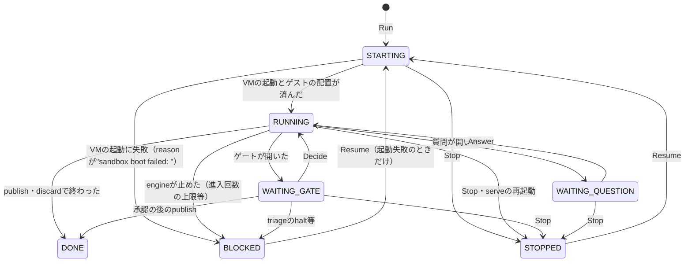

# サービスとRPC

公開APIは6つのサービスからなる。ここでは各RPCが何のためにあり、どの順で呼ぶものかを書く。フィールドの一覧は生成した[APIリファレンス](reference.md)に、失敗の条件は[エラーコード](errors.md)にある。

| サービス | 扱うもの |
|---|---|
| [WorkspaceService](#workspaceservice) | ワークスペース（1つの実行）の開始・観測・停止・削除 |
| [GateService](#gateservice) | 人間の判断を待つゲートの表示と判断 |
| [QuestionService](#questionservice) | エージェント（または定義）が出した質問への回答 |
| [StagingService](#stagingservice) | ワークスペースのstaging（gitのbareリポジトリ）の読み出しとコメント |
| [ConfigService](#configservice) | 対象リポジトリの宣言と、利用者ごとの承認・秘密の値・イメージ |
| [WorkflowService](#workflowservice) | 実行前の定義の一覧・図・検査 |

## 用語

- **ワークスペース**: 1つのワークフローの実行。ID（12桁の16進）・stagingのbareリポジトリ・記録・（動いていれば）VM1つの組
- **出現（occurrence）**: engineがノードに入るたびに振る番号（`"0000003"`、foreachの中では`"0000003.1"`のような形）。ゲートと質問は、それを開いた出現で指す
- **ゲート**: 人間の判断を待つ場所。定義の`approval`ノード（`plan`・`review`・`interim`等の名前は定義が決める）と、engineが自分で開く`deviation`（計画外の変更）・`triage`（エージェントが報告した懸念）がある
- **staging**: ワークスペースごとのgitのbareリポジトリ。ゲストの作業はここへ取り込まれ、実リポジトリに触るのはpublishだけ

## WorkspaceService {#workspaceservice}

[リファレンス](reference.md#masuda-api-v1-WorkspaceService)

ワークスペースの状態（`WorkspaceState`）は次のように移る。

| RPC | 何のためか | 前後関係 |
|---|---|---|
| `Run` | 対象リポジトリでワークフローを新しいワークスペースで始める | 定義の検査・前提（秘密・承認・イメージ）の確認・stagingの作成までを同期で行い、STARTINGで返る。VMの起動は返った後に裏で進むので、結果は`Watch`か`Get`で見る。起動の失敗は`Run`のエラーにならず、BLOCKED（`reason`が`sandbox boot failed: `で始まる）として現れる |
| `Resume` | STOPPEDのワークスペース（と起動に失敗したBLOCKED）を、記録から計算した位置で続ける | 新しいVMを作り、stagingから再cloneし、最後のWIPスナップショットを作業ツリーへ戻す。定義は開始時の写しを使い、承認・秘密の値は今の設定から読み直す。再開前に開いていたエージェントの質問は破棄される |
| `Get` | 1つのワークスペースの今の状態 | `activity`はその時点で計算した値 |
| `List` | ワークスペースの一覧（作成順） | `repo_root`を渡すとそのリポジトリの分だけ。文字列として一致するものだけを返す |
| `Watch` | 状態の変化とイベントを流し続ける | GUIは基本的にこれを開いたままにする。[典型的な流れ](flows.md#watch)を参照 |
| `Stop` | VMを止める。記録とstagingは残る | 動いているノードは中断される。続きは`Resume`。STOPPEDへの`Stop`は何もせず返る |
| `Remove` | ワークスペースを消す。`exports/`だけは残す | 動いているものは`force`が要る（止めてから消す）。消した後は`Get`等が`not_found`になる |
| `AttachInfo` | ゲストのtmux（メインのClaude Codeのセッション）へ入るための`ssh`のコマンド行 | VMが起動済みのときだけ。呼ぶたびに鍵が替わる（前の接続は切れない）。返った`ssh_argv`をそのまま端末で実行する |

返すコード: `Run`は`invalid_argument`・`failed_precondition`・`already_exists`、`Resume`・`Remove`・`AttachInfo`は`failed_precondition`、IDを取るものはすべて`not_found`。`AttachInfo`はフェイクsandboxでは`unimplemented`。詳細は[エラーコード](errors.md#workspaceservice)。

### Workspaceの読み方

- `state`はengineの位置とVMの有無から決まる。`activity`はその中で「エージェントが今何をしているか」（[活動の表示](flows.md#activity)）
- `position`は人間向けの現在位置（`"agent planner (occ 0000001)"`・`"gate review (occ 0000005)"`・`"done"`）。形は変わりうるので解析しない
- `outcome`はDONEになったときの終わり方（定義の`end`のラベル等）。`reason`はBLOCKEDの理由
- `open_gates`はゲートの名前、`open_questions`は質問の出現。一覧の表示用で、判断するときは`GateService.ListOpen`・`QuestionService.ListOpen`から対象を取る

## GateService {#gateservice}

[リファレンス](reference.md#masuda-api-v1-GateService)

| RPC | 何のためか | 前後関係 |
|---|---|---|
| `ListOpen` | 判断を待っているゲートの一覧。`workspace_id`が空なら全ワークスペース | ワークスペースがWAITING_GATEになったら呼ぶ |
| `Get` | 1つのゲートの中身と判断 | その出現が開いたゲートのうち最後のもの（deviationは同じ出現で何度も開く）。判断済みなら`decision`が入る |
| `Decide` | 判断を記録し、実行を進める | 戻った時点で、判断の後の位置（次のゲート・publish等）まで進んでいる。`approved`には、表示した内容の`target_hash`を渡す |

ゲートの種類ごとの`subject`と、取れる判断:

| `gate` | `target` | `subject` | 判断 |
|---|---|---|---|
| 定義のゲート（`plan`・`review`・`interim`等） | `plan`・`diff`・データ名 | `target`のデータの中身（`plan`ならJSON）。`diff`なら`refs/masuda/base..staging_commit`のunified diffと、続けて「publishされない変更（未コミット）」のファイル一覧 | `approved`（`target_hash`必須）・`rejected` |
| `deviation` | 空 | 計画外に変わったファイルのパス（改行区切り） | `approved`（`target_hash`必須、`approved_files`）・`rejected` |
| `triage` | 空 | エージェントが報告した懸念の本文 | `dismiss`・`halt`・`redo`（`target_hash`不要） |

triageで入り直した出現の古いゲートは`decision.outcome: "superseded"`で閉じられる（判断済みとして扱う）。どれも`comment`を付けられ、`rejected`・`redo`のコメントはエージェントへの差し戻しの理由になる。判断の意味と表示の仕方は[ゲートの表示と判断](flows.md#gates)にある。

返すコード: `Decide`は判断済み・`target_hash`の不一致・今待っていないゲート・止まっているワークスペースに`failed_precondition`、`outcome`が空・ゲートの種類に合わないなら`invalid_argument`、無いゲートは`not_found`。詳細は[エラーコード](errors.md#gateservice)。

## QuestionService {#questionservice}

[リファレンス](reference.md#masuda-api-v1-QuestionService)

| RPC | 何のためか | 前後関係 |
|---|---|---|
| `ListOpen` | 答えを待っている質問の一覧。`workspace_id`が空なら全ワークスペース | ワークスペースがWAITING_QUESTIONになったら呼ぶ |
| `Answer` | 質問に答え、実行を進める | すべての`items`の`id`に答える。`options`のある項目はその中から選ぶ |

質問を出すのは、`question`ノードのエージェント（MCPの`ask_human`。1つの出現で何度も聞ける）と、定義に`questions:`を書いた固定の質問の2通り。答えは次のノードの入力データになる。

返すコード: 答えの過不足・選択肢以外は`invalid_argument`、開いていない質問は`not_found`、止まっているワークスペースは`failed_precondition`。詳細は[エラーコード](errors.md#questionservice)。

## StagingService {#stagingservice}

[リファレンス](reference.md#masuda-api-v1-StagingService)

stagingを読むだけで、refは動かさない。止まった・終わったワークスペースでも、`Remove`するまで読める。

| RPC | 何のためか | 前後関係 |
|---|---|---|
| `ListRefs` | stagingのrefとコミットの一覧 | 差分ビューの基準と対象を選ぶのに使う |
| `GetCommit` | コミット1つ（親・作者・時刻・メッセージ・第1親から変わったファイル） | |
| `Diff` | 2つのrevの間のunified diff。`from`が空なら`to`の第1親から | `paths`で絞れる（globは解釈しない） |
| `GetBlob` | あるrevの時点のファイルの中身（64KiBずつのストリーム） | 差分の前後の全文を見せるのに使う |
| `ListComments` | 差分へのコメント。`commit`を渡すとそのコミットのものだけ | |
| `AddComment` | 人間のコメントを付ける（`author`は`"human"`） | `commit`はref名でもよく、記録はハッシュに解決して残る（refが後で動いても別のコミットへのコメントに化けない） |

stagingにあるref:

| ref | 意味 |
|---|---|
| `refs/heads/<branch>` | ワークスペースのブランチ。commitノードが進め、publishされるのはこれ |
| `refs/masuda/base` | 分岐元。ブランチ全体の差分の基準 |
| `refs/masuda/wip/<出現>` | ノード境界の作業ツリーのスナップショット（コミットしていない変更を含む） |
| `refs/masuda/worktree` | 最後に取り込んだ作業ツリー（commitの直前・差分の計算のたびに動く） |
| `refs/heads/<実リポジトリのブランチ>` | cloneしたときに実リポジトリにあったブランチ |

返すコード: 解決できないrevは`not_found`、空や`-`で始まるrevは`invalid_argument`、空の`body`は`invalid_argument`。詳細は[エラーコード](errors.md#stagingservice)。

## ConfigService {#configservice}

[リファレンス](reference.md#masuda-api-v1-ConfigService)

対象リポジトリの`.masuda/settings.json`（コミットされる宣言）と`.masuda/settings.local.json`（利用者ごとの承認）を、作業ツリーから直接読み書きする。宣言に無いものは承認も値の登録もできない。承認や値の変更は、次の`Run`か`Resume`から効く（動いているワークスペースには効かない）。

| RPC | 何のためか |
|---|---|
| `ListEgress` / `ApproveEgress` / `RejectEgress` | ゲストが届いてよいホストの宣言と承認。宣言と承認の両方にあるホストだけが許される |
| `ListSecrets` | 宣言した秘密の一覧と、値の有無・承認の要否と有無。`claude_token_set`はClaude APIのトークンの値の有無（トークンは一覧に入らない） |
| `SetSecret` | 秘密の値をホストの秘密ストアに置く。値は二度と返らない。Claudeのトークンもこれで置く（名前は`CLAUDE_CODE_OAUTH_TOKEN`か、`settings.local.json`の`claudeToken`） |
| `ApproveSecret` / `RejectSecret` | `plaintext`モード（本物の値がゲストに入る）の秘密の承認。`placeholder`モードは承認が要らない |
| `ListPrivilegedCommands` / `ApprovePrivilegedCommand` | 特権コマンド（rootの2つ目のVMで動くコマンド）の宣言と承認。承認は宣言のハッシュに結びつき、宣言が変わると`stale`になる。取り消しのRPCは無い（`settings.local.json`から消す） |
| `ListImages` | `.masuda/images/<entry>/Dockerfile`のあるエントリと、最後のビルドが今もsandbox serviceにあるか |
| `BuildImage` | イメージをビルドする。ログの行を流し、最後のメッセージに`build_id`が入る。`Run`・`Resume`も起動のたびにビルドする（変更が無ければsandbox側で既存のものが返る）ので、前もって呼ぶのは時間のかかる初回を先に済ませたいときだけでよい |

返すコード: 宣言に無い名前・ホストは`invalid_argument`、設定ファイルが読めなければ`failed_precondition`、Dockerfileが無ければ`not_found`。詳細は[エラーコード](errors.md#configservice)。

## WorkflowService {#workflowservice}

[リファレンス](reference.md#masuda-api-v1-WorkflowService)

`Run`の前に定義を確かめるためのもの。作業ツリーの`.masuda/`をそのまま読み（写しは取らない）、`repo_root`が空なら同梱の定義だけを読む。

| RPC | 何のためか |
|---|---|
| `List` | ワークフローの一覧。`origin`はどこから来たか（同梱か、リポジトリの上書きか）、`inputs`は`Run`で渡すべき入力の名前 |
| `Show` | engineが割り込み（triage・deviation）を描き足したMermaidの図 |
| `Check` | 定義の問題の一覧。`workflow`が空なら全ワークフローを検査する。定義が読み込めないときもエラーにせず、理由を問題の1つとして返す |

返すコード: 定義に無いワークフローは`not_found`、`repo_root`の誤りは`invalid_argument`。詳細は[エラーコード](errors.md#workflowservice)。
