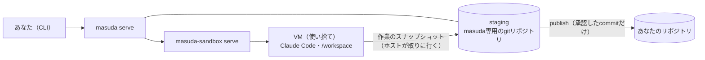

# 概念

masudaを使うときに出てくる言葉と、masudaが守っている約束をまとめる。

## 全体の形

エージェントはVMの中で動き、あなたのリポジトリにもホストのファイルにも直接は触れない。作業はmasudaの手元のstagingに溜まり、あなたが承認したものだけがリポジトリへ届く。

## ワークスペース {#workspace}

`masuda run`1回ぶんの実行の単位。12桁のID（例 `4f1c2a9e8b3d`）を持ち、次の組からなる。

- 対象リポジトリ・ブランチ・分岐元・ワークフロー
- staging（下記）
- ホスト側の記録（`~/.local/share/masuda/workspaces/<id>/`）
- 動いている間は、VMが1つ

状態（`masuda list`のSTATE）:

| 状態 | 意味 |
|---|---|
| `starting` | VMを起動している |
| `running` | エージェントやコマンドが作業している |
| `waiting_gate` | ゲートで人間の判断を待っている |
| `waiting_question` | 質問への回答を待っている |
| `stopped` | 止めた（`masuda stop`、または`masuda serve`の再起動）。`masuda resume`で続きから再開できる |
| `done` | ワークフローが終わった（publishやdiscardを含む） |
| `blocked` | 進めなくなって止まった。理由は`masuda list`のPOSITION等に出る |

## staging

masudaだけが読み書きする、ワークスペースごとのgitのbareリポジトリ（`workspaces/<id>/staging.git`）。始めるときにあなたのリポジトリから複製して作る。

- ワークスペースのブランチ（`--branch`で決めた名前）はstagingの中にだけ作られ、コミットもstagingに積まれる
- ワークフローのノードが1つ終わるたびに、masudaがVMの作業ツリー全体のスナップショット（WIP）を取り込む。gitignoreされたファイルは含まない
- VMの中のエージェントにはstagingへ書く手段が無い。取り込みは常にホストから取りに行く

## VM

1ワークスペースにつき1つ。`.masuda/images/<entry>/Dockerfile`から作ったイメージで起動する。イメージは`masuda run`を打った**作業ツリー**の`.masuda/`から作る（`--branch`で指したブランチの`.masuda/`は使わない）。`Dockerfile`の`RUN`はホストのDockerで動くので、信頼できないブランチの定義を作業ツリーに取り出してから`run`しないこと。レビューしたいだけなら`--branch`で指せば、作業ツリーは`main`のままでよい。

- 中には対象リポジトリのclone（`/workspace`）と、Claude Code（tmuxの`claude-work`セッション）がいる
- **使い捨て**。止めたり、ホストを再起動したりすれば失われる。続きは新しいVMをstagingから作り直して再開する（最後のスナップショットの作業ツリーを、コミットしていない変更として戻す）。VMの中にだけ置いたもの（キャッシュ、生成物）は消える前提で使う
- VMから外への通信は、許可したホストへのHTTP（とTLS）だけ（[秘密・egress・特権コマンド](secrets-and-egress.md)）

## エージェントへの指示をどこに書くか {#where-to-write}

VMの中のClaude Codeが読む指示は、誰と共有するかで置き場所を選ぶ。あなたのホストの`~/.claude/`はVMに入らない。

| 範囲 | 置き場所 | VMへの届き方 |
|---|---|---|
| プロジェクトで共有し、版管理する | リポジトリの`CLAUDE.md`・`.claude/` | `/workspace`のcloneに入るので、そのまま届く（masudaの外でClaude Codeを使うときにも効く） |
| プロジェクトで共有し、版管理する（masudaで動かすときだけ） | `.masuda/claude/` | 実行開始時に`~/.claude/`へ写す（[設定](settings.md#claude-dir)） |
| あなた個人 × このプロジェクト | `.masuda/claude.local/`（gitignore） | 同上。同じパスは`.masuda/claude/`より優先 |

## ワークフローとノード

ワークフローは「どの役のエージェントに何をさせ、どこで人間に聞くか」を書いたYAML。同梱の`develop`は調査→計画→承認→ステップごとの実装→レビュー→承認→反映を行う。各段階が**ノード**で、エージェントに1つのタスクをさせる`agent`、決まったコマンドを動かす`exec`、人間の承認を待つ`approval`などがある（[ワークフロー](workflows.md)）。

同じノードに何度入ったかを区別するため、ノードに入るたびに**出現ID**（`000004`のような連番。ゲートや質問を指すときに使う）が振られる。

## ゲート

人間の判断を待つ場所。`masuda gate list`で開いているものを見て、`masuda gate show`で中身を読み、判断する。

| ゲート | いつ開くか | 判断 |
|---|---|---|
| `plan` | `develop`で計画ができたとき。中身は計画 | 承認すると実装へ。却下すると計画をやり直す |
| `interim` | `develop`の各ステップで、途中レビューの指摘を直しきれなかったとき。中身は**このステップでこれからコミットされる差分**（ブランチ先頭からの未コミットの変更。`target: step-diff`）。`review`の「publishされる差分（コミット済み）」とは違う | 承認するとそのステップをコミットして次へ。却下するとそのステップの実装をやり直す |
| `review` | `develop`の最後。中身は分岐元からの差分 | 承認するとpublish。却下すると手直しとレビューをやり直す |
| `deviation` | 計画に無いファイルが変わっていたとき（下記） | 承認するとき`--file`で計画に加えるファイルを選ぶ。却下の結果は開いた場面で違う（下記） |
| `triage` | エージェントが作業中にセキュリティ上の懸念を報告したとき。どのノードにも割り込む | `dismiss`（懸念を退けて続ける）、`halt`（実行を止める）、`redo`（そのタスクをやり直させる） |

`plan`・`interim`・`review`はワークフローに書かれたゲートで、自分のワークフローでは好きな名前を付けられる。`deviation`と`triage`はmasudaが常に差し込むもので、ワークフローから外せない。

承認は、あなたが`gate show`で見た内容のハッシュ（`target_hash`）に結びつく。`--hash`を渡せば、見た後に内容が変わっていた場合は承認が断られる。

### 計画外の変更（deviation）

masudaは「承認した計画の範囲」でしかコミットしない。

- コミットの直前に、計画のステップが対象にしていないファイルの変更があれば`deviation`ゲートを開く
- 書き込めない役（調査・レビュー等）のエージェントの実行中に作業ツリーが変わったときも開く（テストの実行で`__pycache__`が書き換わった等。[トラブルシューティング](troubleshooting.md#deviation)）

承認時に`--file`で並べたファイルだけが計画に加わり、並べなかった変更はコミットされずにVMの作業ツリーに残る。却下すると、コミットの直前に開いたものは実装のやり直しになり、書き込めない役の実行中の変更で開いたものは実行全体が`blocked`で止まる。

## 質問

ワークフローに`question`ノードがあると、エージェント（または定義に書いた固定の質問）が構造化した質問を出し、回答を待つ（`waiting_question`）。`masuda question list`で読み、`masuda question answer <id> <出現ID> <質問のid>=<答え>`で答える。同梱の`develop`には質問のノードは無い。

エージェントは、質問のノードの中でしか人間に聞かない約束になっている。それ以外で迷ったときは、決められた終わり方（「計画どおりにできない」等）と説明で報告する。

## commit・publish・discard

- **commit**: ホスト側のmasudaが、VMの作業ツリーのうち計画の対象ファイルだけでコミットを作り、stagingのブランチを進める。エージェントが`git commit`したものがそのまま採られるのではない
- **publish**: stagingのブランチを、あなたのリポジトリの同じ名前のブランチへfast-forwardで反映する（ワークフローで`target: remote`にすると、代わりに`settings.json`の`publish.remote`、既定`origin`へpushする）。反映するのは`review`ゲートで承認したcommitと同じものだけで、承認の後にブランチが動いていれば反映しない
- **discard**: 反映せずに終える（同梱の`review`ワークフローはこれで終わる）

publishとdiscardの最後に、結果（exports）を書き出してからVMを壊す。stagingは`masuda remove`まで残る。

## exports

ワークフローが終わったときに残す結果。`workspaces/<id>/exports/`に置かれ、`masuda remove`でも消えない。中身はワークフローが書き出すと決めたデータ（`develop`ならレビューのレポート`report`）、実行ログ、エージェントの会話ログ（[運用](operations.md#exports)）。

## masudaが守っている約束

### あなたのリポジトリに触れるのはpublishだけ

- 始めるときにリポジトリを読んで複製するが、ブランチもrefも作らない
- エージェントの作業はVMの中とstagingにだけ溜まる
- リポジトリに書き込むのは、あなたが`review`ゲートで承認したcommitのpublishだけ。fast-forwardにならなければ何も変えない

### 秘密はVMに入らない {#secrets}

- ClaudeのトークンやAPIキーの本物の値は、ホストの`~/.local/share/masuda/secrets/`にだけ置く。リポジトリにも`settings.json`にも書かない
- VMの中には、本物の値の代わりにそれらしい形のプレースホルダが入る。VMからの通信がmasuda-sandboxを通るとき、宣言した送り先のホスト宛ての場合に限ってプレースホルダを本物の値に置き換える
- したがってVMの中のエージェントが汚染されても、本物の値を読み出せない。許可していないホストへプレースホルダを送っても意味が無い
- 例外は、`plaintext`モードで宣言し、あなたが承認した秘密だけ（[秘密・egress・特権コマンド](secrets-and-egress.md#plaintext)）

### 宣言と承認 {#declare-approve}

`.masuda/settings.json`はリポジトリにコミットされる**宣言**で、誰でも書き換えられる。通信先・平文の秘密・特権コマンドは、宣言しただけでは効かず、あなたの`.masuda/settings.local.json`（コミットしない）の**承認**と揃ったときだけ効く。チームメイトが宣言を足しても、あなたが承認するまであなたの環境では何も起きない。

### VMの出力は信用しない

VMから出てくるもの（エージェントの出力、スナップショット）は、masudaが受け取るときに検証する。決められた形（スキーマ）に合わない出力はエージェントへ差し戻す。
