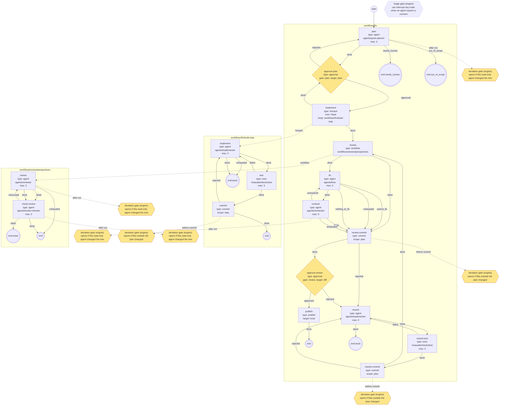
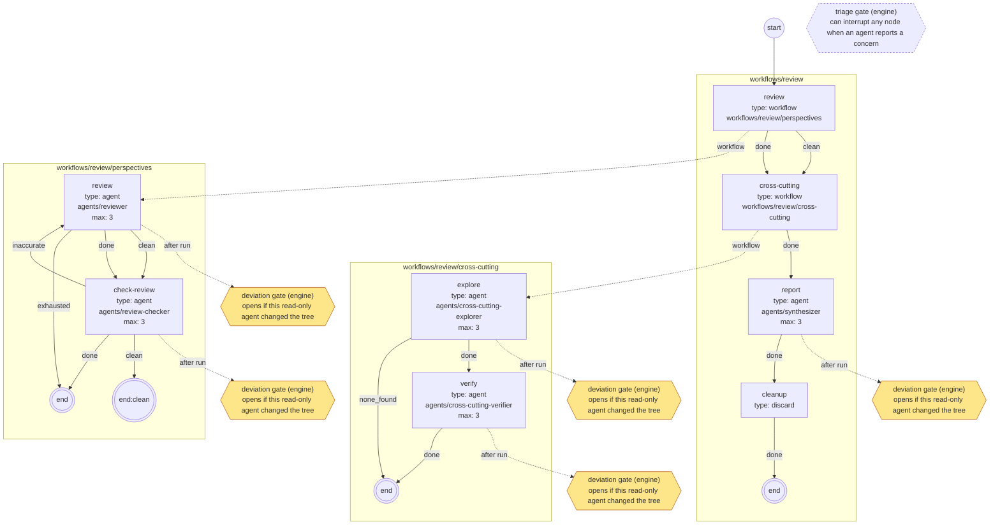

# ワークフロー

ワークフローは「どの役のエージェントに何をさせ、どこで人間に聞き、いつコミットして反映するか」を書いたYAML。masudaは人が始める同梱のワークフローを3つ持ち、対象リポジトリの`.masuda/`で上書き・追加できる。

このページは導入と同梱の説明。キーの全仕様は[ワークフロー定義の仕様](reference/workflow-schema.md)にある。

## 3種類の定義

| 種類 | 置き場所 | 中身 |
|---|---|---|
| ワークフロー | `.masuda/workflows/**.yaml` | ノードと、その終わり方ごとの行き先 |
| エージェント | `.masuda/agents/**.md` | 役（調査・計画・実装・レビュー等）。frontmatterで使える道具・入力・出力・終わり方を宣言し、本文が役のプロンプトになる |
| スキーマ | `.masuda/schemas/<データ名>.json` | ノードの間で受け渡すデータの形（JSON Schema）。masudaが受け取るときに検証し、合わなければエージェントへ差し戻す |

参照は`.masuda/`からの拡張子なしのパスで書く（`workflows/develop`、`agents/planner`）。

## ワークフローの書き方

```yaml
version: 1
inputs: [instructions]        # masuda run --input で受け取るデータ
start: investigate
nodes:
  investigate:
    type: agent               # エージェントに1つのタスクをさせる
    role: agents/investigator
    next: summarize           # 終わり方 done の行き先（省略形）
  summarize:
    type: agent
    role: agents/summarizer
    next: finish
  finish:
    type: discard             # 反映せずに終え、データを exports に書き出す
    export: [investigation, summary]
    next: end
```

ノードの種類:

| type | 何をするか |
|---|---|
| `agent` | エージェントに1つのタスクをさせる。終わり方はエージェント定義の`outcomes` |
| `exec` | 決まったコマンドをVMの中で動かす（例 `command: ["/masuda/checks/test"]`）。終了コード0で`done`、それ以外で`failed` |
| `approval` | 人間の承認を待つ（ゲート）。`gate`にゲートの名前、`target`に見せるもの（`plan`・`diff`＝publishされるコミット済みの差分・`step-diff`＝これからcommitされる未コミットの差分・データ名） |
| `question` | 人間に質問して答えを待つ |
| `foreach` | 計画のステップ・レビュー観点・配列のデータの項目ごとに、別のワークフローを順に動かす |
| `workflow` | 別のワークフローを呼ぶ |
| `commit` | 計画の範囲の変更をコミットする（`scope: step`か`plan`） |
| `publish` | あなたのリポジトリへ反映して終える（`target: local`既定、`remote`で`settings.json`の`publish.remote`（既定`origin`）へpush） |
| `discard` | 反映せずに終える |

`agent`ノードに`continues: agents/<役>`を書くと、そのタスクを、この実行でその役が最後に担当したサブエージェントに続きとして渡す（前の作業の記憶を持ったまま次の仕事をさせる）。同梱のdevelop・fixでは、指摘を直す`fix`ノード（fixer）が、直前に実装したimplementerを続ける。続きは成り立たないこともある（`resume`でVMを作り直した後など）ので、そのときは新しいサブエージェントが入力だけから進める。続ける役の入力は、記憶が無くても仕事ができるだけのものを渡すこと。また、続ける側の役の`tools`は続けられる側の`tools`の一部でなければならない（`tools`の省略は続けられる側も省略のときだけ可）。サブエージェントの道具は起動時に決まり、続きで増やせないためで、満たさないと検査で拒否される。

`next`は「終わり方→行き先」の対応で、行き先はノード名か`end`（`end:<ラベル>`で終わり方に名前を付けられる）。`max`（`agent`・`exec`の既定3）は同じノードに入れる回数の上限で、超えると`exhausted`という終わり方になる。

ノードごとに`egress:`（そのノードの間だけ開く通信先）と`secrets:`（そのノードの間だけ使える秘密）を書ける。どちらも`settings.json`の宣言とあなたの承認の範囲の中からしか選べない（[秘密・egress・特権コマンド](secrets-and-egress.md)）。

### masudaが必ず差し込むもの

ワークフローに書かなくても、次は常に働き、外せない。

- `triage`ゲート: エージェントがセキュリティ上の懸念を報告したら、どこからでも割り込む
- `deviation`ゲート: コミットの直前と、書き込めないエージェントの実行の後に、計画外の変更を確かめる
- 書き込めるエージェント（`tools`に`Write`か`Edit`を持つ、または`tools`を省略した）と`commit`は、承認済みの計画がある状態でしか動けない。読み込みの検査で、計画の承認より前にそれらへ届く経路があれば拒否する
- 1回の実行のノードの出現は20000までで打ち切る

## エージェントの書き方 {#write-agent}

```markdown title=".masuda/agents/summarizer.md"
---
name: summarizer
description: 調査結果を、人間が読む3行の要約にする
tools: Read, Grep, Glob
inputs: [investigation]
outputs: [summary]
outcomes:
  done: 要約を書いた
---
入力の調査結果（`investigation`）を読み、要点を3行以内の日本語で`summary`に書く。コードは変更しない。
```

- `tools`: Claude Codeの道具の名前。`Write`・`Edit`を持たないエージェントは「書き込めない」役になり、作業ツリーを変えると`deviation`ゲートが開く
  - [`.masuda/claude/`](settings.md#claude-dir)に置いたスキルを使わせるなら、`tools`に`Skill`を足す。同梱のエージェントは`Skill`を持っている
- `inputs`・`outputs`: 受け取る・書くデータの名前。入力はVMの`/masuda/in/<出現ID>/<名前>`にファイルとして置かれる
- `outcomes`: 終わり方と、その意味の説明。`done`は必須。エージェントはこの中から1つを選んで報告する
- `model`・`effort`（任意）: その役のサブエージェントのモデルと推論の努力量。VMの中のClaude Codeのサブエージェント定義にそのまま渡る
  - `model`: `sonnet`・`opus`・`haiku`等の別名、フルのモデルID、`inherit`。省略するとメインセッションのモデル（[`claudeSettings`](settings.md#claudesettings)の`model`）を継承する
  - `effort`: `low`・`medium`・`high`・`xhigh`・`max`のいずれか。省略するとセッションの既定を継承する
  - `continues`で続きが成立したサブエージェントは、起動時の`model`・`effort`のまま動く。続ける側の役の値は、新しく起動したときだけ使われる
  - 同梱の役のモデルを変えるときは、定義を写さずに設定の[`agents`](settings.md#agents)に書く。`agents`の値はfrontmatterより優先する

本文には役の仕事だけを書けばよい。masudaとのやり取り（入力の読み方、出力の書き方、報告の仕方）はmasudaがエージェントに教える。同梱のエージェント（15個）の定義は[masuda-engineの`engine/defaults/agents/`](https://github.com/TadahiroYamamura/masuda-engine/tree/main/engine/defaults/agents)にあり、書き方の見本になる。

## データとスキーマ

ノードの間で受け渡すものはすべて名前の付いたデータで、実体はホストのファイル（`workspaces/<id>/data/`）。

- `.masuda/schemas/<データ名>.json`を置くと、そのデータはJSON Schema（draft 2020-12）で検証される。スキーマが無いデータは空でないことだけを確かめる
- スキーマのトップレベルが`"type": "string"`なら、出力をJSONとして読まず、ファイルの中身をそのまま1つの文字列として検証する

```json title=".masuda/schemas/summary.json"
{
  "$schema": "https://json-schema.org/draft/2020-12/schema",
  "type": "string",
  "maxLength": 2000
}
```

- masudaが自分で用意するデータ: `diff`（分岐元からの差分）、`step-diff`（今のステップの差分）、`fix-diff`（修正を始めた時点からの差分）
- 同梱のスキーマ: `plan`（計画。計画への問いと答えの`checks`を含む）、`plan-checklist`（計画への問い）、`findings`（指摘の台帳。実行中に書かれたものが溜まっていく）、`commit-message`、`comment-manifest`（実装する役・直す役が追加・変更したコメントと、それぞれが満たす基準の一覧。溜まっていく。観点[`comment-criteria`](reviews.md)が照合する）、`selected-perspectives`、`answers`

## 同梱のワークフロー

`masuda workflow list`で一覧が出る。人が始めるのは`develop`・`fix`・`review`で、残りはその部品。

| ワークフロー | 入力 | 用途 |
|---|---|---|
| `workflows/develop` | `instructions` | 指示書から、調査・計画・実装・レビューをして反映する |
| `workflows/fix` | `instructions` | 小さな修正向け。調査と計画を1つのセッションで済ませ、途中レビュー・横断チェック・レポートを省いて反映する |
| `workflows/review` | なし | 分岐元からの差分をレビューし、レポートを残して終える（反映しない） |
| `workflows/implement/build-step` | `step` | `develop`の部品。計画の1ステップを実装・テスト・途中レビュー・修正・コミットする |
| `workflows/fix/build-step` | `step` | `fix`の部品。計画の1ステップを実装・テスト・コミットする（途中レビュー無し） |
| `workflows/implement/interim-review` | `diff` | 部品。ステップの差分を、`trigger`が当てはまる観点だけで1つのセッションでレビューし、別の役が指摘の正確さを確かめる |
| `workflows/review/perspectives` | `diff` | 部品。全レビュー観点を1つのセッションで差分に当て、別の役が指摘の正確さと見落としを確かめる |
| `workflows/review/cross-cutting` | `diff` | 部品。観点に分けにくい横断的な問題を探して確かめる |
| `workflows/smoke` | `instructions` | 疎通確認用。指示をそのまま書き返して終える |

### develop {#develop}

```text
調査 → 計画 → 問い立て → 問いへの回答と計画の手直し →（答えられない問いがあれば）人間への質問 → 回答を受けた手直し
     → [plan gate] → ステップごとに（実装 → テスト → 途中レビュー → 修正 → 再確認 → コミット）
     → 全観点レビュー → 横断チェック → 修正 → 再確認 → コミット → レポート → [review gate] → publish
```

- 計画を立てる役は、調査が足りなければ調査へ戻し、依頼がこのリポジトリで扱うものでなければ`out_of_scope`で終える
- 計画ができたら、別の役（plan-questions、`questions`ノード）が計画を確かめる問いを立てる（`plan-checklist`）。計画の主張を「達成できたと言えるか」という問いに変え、見落とすと起きる被害の種類（`spec`・`security`・`data`・`release`・`regression`・`performance`・`maintainability`・`other`）ごとに、`SPEC-1`のようなidを付けて挙げる。判定や修正の提案はしない。対象リポジトリに`.masuda/pitfalls.jsonl`（[プロジェクト固有の落とし穴](settings.md#pitfalls)）があれば、当てはまるものも問いに加える
- 計画を直す役（plan-reviser、`revise`ノード）が問いに1つずつ答え、答えに合わせて計画を直す。答えは計画の`checks`に`addressed`（計画で扱った）・`out_of_scope`（範囲外）・`open`（判断できない）として残り、plan gateで計画と一緒に読める（[`masuda gate show`](cli.md#gate)）。調査が足りなければ調査へ戻す
- `open`の問いが残ると、聞く役（plan-interviewer、`ask`ノード）が、それらを1つの質問にまとめて人間に聞く。plan gateより前に`masuda list`の`question:<出現ID>`として現れるので、`masuda question list`で読み、`masuda question answer`で問いのidごとに答える。答えを受けて計画を直す役がもう一度直し（`revise-answered`ノード）、まだ判断できない問いがあれば再び聞く。手直しが上限（3回）に達したときは、そのままplan gateへ進む
- 実装する役（implementer）は計画（`plan`）に加えて調査結果（`investigation`）を読み、既存の流儀に合わせ、既にある機能を重複して作らない
- 実装する役（implementer）と直す役（fixer）は、追加・変更したコードコメントを`comment-manifest`に列挙し、どの基準（10行以上の要約・選択の理由・コードから読めない背景・トレードオフ等）を満たすかを書く。基準を言えないコメントは書かない。レビューでは観点`comment-criteria`がこの一覧と差分を照合する
- ステップの実装は`/masuda/checks/test`（`settings.json`の`checks.test`）が通るまで、最大3回やり直す。直せなければ`stuck`で計画の承認へ戻る
- レビューと修正は役ごとに1つのセッションで行う。レビューする役（reviewer）が観点を順に当てて指摘を台帳（`findings`）に書き、確かめる役（review-checker）が指摘の正確さを確かめる（不正確ならreviewerへ戻す）。直す役（fixer）は、実装したサブエージェントの続きとして（`continues: agents/implementer`）自動で直してよい指摘（`autofix: true`）をまとめて直し、指摘が誤り・計画の判断に反すると判断したものは直さずに反論する。再確認する役（rechecker）が解消を確かめ、反論が妥当なら指摘を取り下げる（未解決ならfixerへ戻す）
- 途中レビューは、ステップの差分（`step-diff`）に対して、reviewerが各観点の`trigger`を見て当てはまる観点だけで行う（[レビュー観点](reviews.md)）。指摘が無ければ（`clean`）、または直す指摘が無ければ（`nothing_to_fix`）そのままコミットする。直しきれなければ`interim`ゲートで止まる
- 最後のレビューは全観点で行う。指摘が0件でもreview-checkerが見落としを確かめる。横断チェックの後に修正と再確認をし、直しきれない指摘はレポートに残してコミットへ進む。レポート（`report`）を書いて`review`ゲートを開く。却下するとコメントを踏まえて手直し（`rework`）からやり直す
- publishのとき`report`をexportsに書き出す

`masuda workflow show workflows/develop`が出す図（部品と、masudaが差し込むゲートを含む。黄色が人間の判断）:

```mermaid
%% workflows/develop
flowchart TD
  entry((start)) --> w0_investigate
  subgraph w0_graph["workflows/develop"]
    w0_investigate["investigate<br/>type: agent<br/>agents/investigator<br/>max: 3"]
    w0_plan["plan<br/>type: agent<br/>agents/planner<br/>max: 4"]
    w0_questions["questions<br/>type: agent<br/>agents/plan-questions<br/>max: 3"]
    w0_revise["revise<br/>type: agent<br/>agents/plan-reviser<br/>max: 3"]
    w0_ask{"ask<br/>type: question<br/>agents/plan-interviewer"}
    w0_revise_answered["revise-answered<br/>type: agent<br/>agents/plan-reviser<br/>max: 3"]
    w0_approve_plan{"approve-plan<br/>type: approval<br/>gate: plan, target: plan"}
    w0_implement["implement<br/>type: foreach<br/>over: steps<br/>body: workflows/implement/build-step"]
    w0_review["review<br/>type: workflow<br/>workflows/review/perspectives"]
    w0_cross_cutting["cross-cutting<br/>type: workflow<br/>workflows/review/cross-cutting"]
    w0_fix["fix<br/>type: agent<br/>agents/fixer<br/>max: 3"]
    w0_recheck["recheck<br/>type: agent<br/>agents/rechecker<br/>max: 3"]
    w0_review_commit["review-commit<br/>type: commit<br/>scope: plan"]
    w0_report["report<br/>type: agent<br/>agents/synthesizer<br/>max: 3"]
    w0_approve_review{"approve-review<br/>type: approval<br/>gate: review, target: diff"}
    w0_rework["rework<br/>type: agent<br/>agents/implementer<br/>max: 3"]
    w0_rework_test["rework-test<br/>type: exec<br/>/masuda/checks/test<br/>max: 3"]
    w0_rework_commit["rework-commit<br/>type: commit<br/>scope: plan"]
    w0_publish["publish<br/>type: publish<br/>target: local"]
    w0_end_done((("end")))
    w0_end_out_of_scope((("end:out_of_scope")))
    w0_end_stuck((("end:stuck")))
  end
  w0_investigate -. "after run" .-> w0_investigate_deviation{{"deviation gate (engine)<br/>opens if this read-only agent changed the tree"}}
  w0_investigate -->|"done"| w0_plan
  w0_plan -. "after run" .-> w0_plan_deviation{{"deviation gate (engine)<br/>opens if this read-only agent changed the tree"}}
  w0_plan -->|"done"| w0_questions
  w0_plan -->|"needs_more_investigation"| w0_investigate
  w0_plan -->|"out_of_scope"| w0_end_out_of_scope
  w0_questions -. "after run" .-> w0_questions_deviation{{"deviation gate (engine)<br/>opens if this read-only agent changed the tree"}}
  w0_questions -->|"done"| w0_revise
  w0_revise -. "after run" .-> w0_revise_deviation{{"deviation gate (engine)<br/>opens if this read-only agent changed the tree"}}
  w0_revise -->|"done"| w0_approve_plan
  w0_revise -->|"exhausted"| w0_approve_plan
  w0_revise -->|"needs_human"| w0_ask
  w0_revise -->|"needs_more_investigation"| w0_investigate
  w0_ask -->|"answered"| w0_revise_answered
  w0_revise_answered -. "after run" .-> w0_revise_answered_deviation{{"deviation gate (engine)<br/>opens if this read-only agent changed the tree"}}
  w0_revise_answered -->|"done"| w0_approve_plan
  w0_revise_answered -->|"exhausted"| w0_approve_plan
  w0_revise_answered -->|"needs_human"| w0_ask
  w0_revise_answered -->|"needs_more_investigation"| w0_investigate
  w0_approve_plan -->|"approved"| w0_implement
  w0_approve_plan -->|"rejected"| w0_plan
  w0_implement -->|"done"| w0_review
  w0_implement -->|"stuck"| w0_approve_plan
  w0_implement -. "foreach" .-> w1_implement
  w0_review -->|"clean"| w0_cross_cutting
  w0_review -->|"done"| w0_cross_cutting
  w0_review -. "workflow" .-> w4_review
  w0_cross_cutting -->|"done"| w0_fix
  w0_cross_cutting -. "workflow" .-> w3_explore
  w0_fix -->|"cannot_fix"| w0_review_commit
  w0_fix -->|"done"| w0_recheck
  w0_fix -->|"exhausted"| w0_review_commit
  w0_fix -->|"nothing_to_fix"| w0_review_commit
  w0_recheck -. "after run" .-> w0_recheck_deviation{{"deviation gate (engine)<br/>opens if this read-only agent changed the tree"}}
  w0_recheck -->|"done"| w0_review_commit
  w0_recheck -->|"exhausted"| w0_review_commit
  w0_recheck -->|"unresolved"| w0_fix
  w0_review_commit -. "before commit" .-> w0_review_commit_deviation{{"deviation gate (engine)<br/>opens if files outside the plan changed"}}
  w0_review_commit -->|"done"| w0_report
  w0_review_commit -->|"rejected"| w0_rework
  w0_report -. "after run" .-> w0_report_deviation{{"deviation gate (engine)<br/>opens if this read-only agent changed the tree"}}
  w0_report -->|"done"| w0_approve_review
  w0_approve_review -->|"approved"| w0_publish
  w0_approve_review -->|"rejected"| w0_rework
  w0_rework -->|"done"| w0_rework_test
  w0_rework -->|"stuck"| w0_end_stuck
  w0_rework_test -->|"done"| w0_rework_commit
  w0_rework_test -->|"failed"| w0_rework
  w0_rework_commit -. "before commit" .-> w0_rework_commit_deviation{{"deviation gate (engine)<br/>opens if files outside the plan changed"}}
  w0_rework_commit -->|"done"| w0_review
  w0_rework_commit -->|"rejected"| w0_rework
  w0_publish -->|"done"| w0_end_done
  subgraph w1_graph["workflows/implement/build-step"]
    w1_implement["implement<br/>type: agent<br/>agents/implementer<br/>max: 3"]
    w1_test["test<br/>type: exec<br/>/masuda/checks/test<br/>max: 3"]
    w1_review["review<br/>type: workflow<br/>workflows/implement/interim-review"]
    w1_fix["fix<br/>type: agent<br/>agents/fixer<br/>max: 3"]
    w1_recheck["recheck<br/>type: agent<br/>agents/rechecker<br/>max: 3"]
    w1_approve_interim{"approve-interim<br/>type: approval<br/>gate: interim, target: step-diff"}
    w1_commit["commit<br/>type: commit<br/>scope: step"]
    w1_end_done((("end")))
    w1_end_stuck((("end:stuck")))
  end
  w1_implement -->|"done"| w1_test
  w1_implement -->|"exhausted"| w1_end_stuck
  w1_implement -->|"stuck"| w1_end_stuck
  w1_test -->|"done"| w1_review
  w1_test -->|"failed"| w1_implement
  w1_review -->|"clean"| w1_commit
  w1_review -->|"done"| w1_fix
  w1_review -. "workflow" .-> w2_interim_review
  w1_fix -->|"cannot_fix"| w1_approve_interim
  w1_fix -->|"done"| w1_recheck
  w1_fix -->|"exhausted"| w1_approve_interim
  w1_fix -->|"nothing_to_fix"| w1_commit
  w1_recheck -. "after run" .-> w1_recheck_deviation{{"deviation gate (engine)<br/>opens if this read-only agent changed the tree"}}
  w1_recheck -->|"done"| w1_commit
  w1_recheck -->|"exhausted"| w1_approve_interim
  w1_recheck -->|"unresolved"| w1_fix
  w1_approve_interim -->|"approved"| w1_commit
  w1_approve_interim -->|"rejected"| w1_implement
  w1_commit -. "before commit" .-> w1_commit_deviation{{"deviation gate (engine)<br/>opens if files outside the plan changed"}}
  w1_commit -->|"done"| w1_end_done
  w1_commit -->|"rejected"| w1_implement
  subgraph w2_graph["workflows/implement/interim-review"]
    w2_interim_review["interim-review<br/>type: agent<br/>agents/reviewer<br/>max: 3"]
    w2_interim_check["interim-check<br/>type: agent<br/>agents/review-checker<br/>max: 3"]
    w2_end_clean((("end:clean")))
    w2_end_done((("end")))
  end
  w2_interim_review -. "after run" .-> w2_interim_review_deviation{{"deviation gate (engine)<br/>opens if this read-only agent changed the tree"}}
  w2_interim_review -->|"clean"| w2_end_clean
  w2_interim_review -->|"done"| w2_interim_check
  w2_interim_review -->|"exhausted"| w2_end_done
  w2_interim_check -. "after run" .-> w2_interim_check_deviation{{"deviation gate (engine)<br/>opens if this read-only agent changed the tree"}}
  w2_interim_check -->|"clean"| w2_end_clean
  w2_interim_check -->|"done"| w2_end_done
  w2_interim_check -->|"inaccurate"| w2_interim_review
  subgraph w3_graph["workflows/review/cross-cutting"]
    w3_explore["explore<br/>type: agent<br/>agents/cross-cutting-explorer<br/>max: 3"]
    w3_verify["verify<br/>type: agent<br/>agents/cross-cutting-verifier<br/>max: 3"]
    w3_end_done((("end")))
  end
  w3_explore -. "after run" .-> w3_explore_deviation{{"deviation gate (engine)<br/>opens if this read-only agent changed the tree"}}
  w3_explore -->|"done"| w3_verify
  w3_explore -->|"none_found"| w3_end_done
  w3_verify -. "after run" .-> w3_verify_deviation{{"deviation gate (engine)<br/>opens if this read-only agent changed the tree"}}
  w3_verify -->|"done"| w3_end_done
  subgraph w4_graph["workflows/review/perspectives"]
    w4_review["review<br/>type: agent<br/>agents/reviewer<br/>max: 3"]
    w4_check_review["check-review<br/>type: agent<br/>agents/review-checker<br/>max: 3"]
    w4_end_clean((("end:clean")))
    w4_end_done((("end")))
  end
  w4_review -. "after run" .-> w4_review_deviation{{"deviation gate (engine)<br/>opens if this read-only agent changed the tree"}}
  w4_review -->|"clean"| w4_check_review
  w4_review -->|"done"| w4_check_review
  w4_review -->|"exhausted"| w4_end_done
  w4_check_review -. "after run" .-> w4_check_review_deviation{{"deviation gate (engine)<br/>opens if this read-only agent changed the tree"}}
  w4_check_review -->|"clean"| w4_end_clean
  w4_check_review -->|"done"| w4_end_done
  w4_check_review -->|"inaccurate"| w4_review
  triage{{"triage gate (engine)<br/>can interrupt any node when an agent reports a concern"}}
  classDef human fill:#fde68a,stroke:#b45309
  classDef engine stroke-dasharray: 4 3
  class w0_ask human
  class w0_approve_plan human
  class w0_approve_review human
  class w0_investigate_deviation human
  class w0_plan_deviation human
  class w0_questions_deviation human
  class w0_revise_deviation human
  class w0_revise_answered_deviation human
  class w0_recheck_deviation human
  class w0_review_commit_deviation human
  class w0_report_deviation human
  class w0_rework_commit_deviation human
  class w1_approve_interim human
  class w1_recheck_deviation human
  class w1_commit_deviation human
  class w2_interim_review_deviation human
  class w2_interim_check_deviation human
  class w3_explore_deviation human
  class w3_verify_deviation human
  class w4_review_deviation human
  class w4_check_review_deviation human
  class triage engine
```



### fix {#fix}

```text
調査と計画（1セッション） → [plan gate] → ステップごとに（実装 → テスト → コミット）
     → 全観点レビュー → 修正 → 再確認 → コミット → [review gate] → publish
```

typoの修正や小さなバグの修正のように、計画が1〜2ステップで済む依頼向け。`develop`との違い:

- 調査と計画を1つのセッション（quick-planner）で行う。quick-plannerは読み取り専用で、調査結果（`investigation`）と計画（`plan`）を書く。実装する役はどちらも読む
- ステップごとの途中レビューと`interim`ゲートが無い。ステップは実装→テスト→コミットだけ
- 最後のレビューは全観点レビュー（reviewer→review-checker）だけで、横断チェックが無い。指摘が無ければ（`clean`）修正と再確認を飛ばしてコミットへ進む
- レポートを書かない。`review`ゲートでは差分と、stagingのコメント（指摘）を見て判断する。publishでexportsに書き出すものも無い
- 指示が曖昧で計画を立てられなければ、quick-plannerは推測で計画を書かず`needs_human`で終える。実行は`outcome needs_human`の`done`になり、確かめたい疑問が理由として`masuda list`のPOSITIONに出る（[運用](operations.md#list)）。疑問に答える形で指示書を直して`run`し直す
- 依頼がこのリポジトリで扱うものでなければ`out_of_scope`で終える（`develop`と同じ）

```sh
masuda run workflows/fix --branch fix/typo --input instructions=@task.md
```

`masuda workflow show workflows/fix`が出す図:



### review

```text
全観点レビュー → 横断チェック → レポート → discard（report と findings を exports へ）
```

コードを変えず、ゲートでも止まらない。終わったら`exports/report`と`exports/findings`を読む。

publishを含まないので、**既にあるブランチ**を`--branch`に指定して、そのブランチの変更をレビューできる。差分の基準は`--base`（省略時はリポジトリの既定のブランチ。originのHEADが指すもの、無ければ`main`・`master`）とブランチの分岐点で、手元のブランチには何も書かない。

```sh
masuda run workflows/review --branch feat/login
masuda run workflows/review --branch feat/login --base develop
```



## 同梱を上書きする・自分のものを足す {#override}

`.masuda/`の下に同梱と**同じパス**のファイルを置くと、同梱のものを丸ごと置き換える（部分的な上書きはできない）。同梱に無いパスなら、新しい定義として足される。

| 置いたファイル | 結果 |
|---|---|
| `.masuda/workflows/develop.yaml` | `workflows/develop`が自分のものになる |
| `.masuda/agents/planner.md` | `develop`が使う計画の役が自分のものになる |
| `.masuda/workflows/investigate.yaml` | 新しいワークフロー`workflows/investigate`が増える |

計画を立てる役（`agents/planner`・`agents/quick-planner`）を差し替えるなら、計画に`checks`を書く（同梱の`plan`のスキーマで必須。問いを立てないなら空配列`[]`でよい）。書かないと計画が差し戻され続ける。

同梱の実装する役（`agents/implementer`）は`plan`と`investigation`を入力に取る。自分のワークフローでimplementerを使うなら、それより前に`investigation`を書くノードを置く（無ければ検査で拒否される）。

同梱の定義の元は[masuda-engineの`engine/defaults/`](https://github.com/TadahiroYamamura/masuda-engine/tree/main/engine/defaults)にある。上書きするときはそこから写して直す。

手順:

1. 定義を書く
2. `masuda workflow list`で、ORIGINが`repo`になっていることを確かめる
3. `masuda workflow check workflows/<名前>`で検査する（`ok`が出るまで直す）
4. `masuda workflow show workflows/<名前>`で図を確かめる（Mermaidを表示できる所に貼る）
5. `masuda run workflows/<名前> --branch ... --input ...`

`masuda run`は始めるときに`.masuda/`を写し、その実行は最後まで写した定義で進む。実行中に定義を直しても、その実行には効かない（`resume`しても同じ）。

### 検査で拒否されるもの

`masuda run`と`masuda workflow check`は、始める前に次を検査する（詳しくは[仕様](reference/workflow-schema.md)の「読み込み時の検査」）。

- 参照先のワークフロー・エージェントがあり、呼び出しが循環しない
- 各ノードが出しうる終わり方すべてに行き先があり、出さない終わり方への行き先が無い
- 承認も`max`も含まない閉路が無い
- 入力データが、そのノードに至るどの経路でも用意されている
- 承認済みの計画が無いまま、書き込めるエージェントや`commit`に届かない
- `continues`で続ける側の役の`tools`が、続けられる側の`tools`の一部になっている
- コミットしていない変更が残ったまま`publish`に届かない
- `masuda run`ではさらに、ワークフローが呼ぶ`/masuda/checks/<名前>`が`settings.json`の`checks`に宣言されていること
