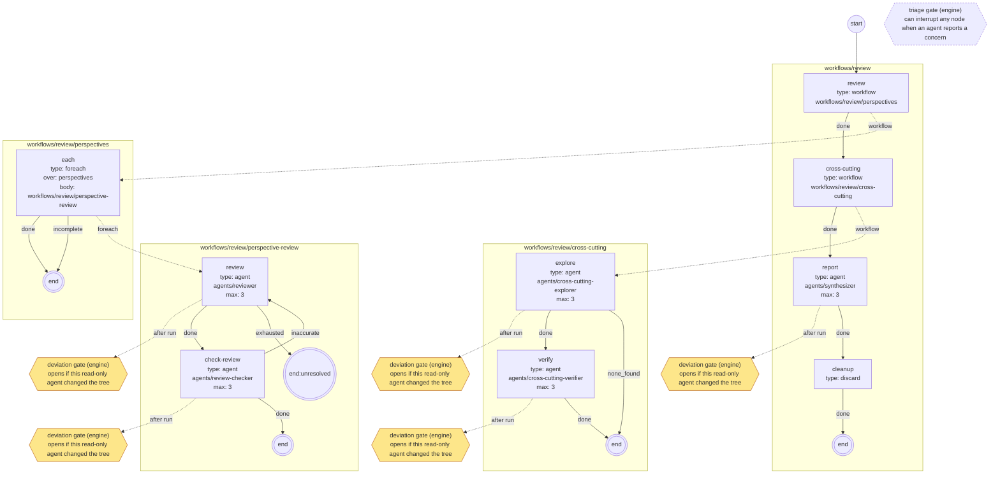

# ワークフロー

ワークフローは「どの役のエージェントに何をさせ、どこで人間に聞き、いつコミットして反映するか」を書いたYAML。masudaは2つの同梱のワークフローを持ち、対象リポジトリの`.masuda/`で上書き・追加できる。

このページは導入と同梱の説明。キーの全仕様は[ワークフロー定義の仕様](reference/workflow-schema.md)にある。

## 3種類の定義

| 種類 | 置き場所 | 中身 |
|---|---|---|
| ワークフロー | `.masuda/workflows/**.yaml` | ノードと、その終わり方ごとの行き先 |
| エージェント | `.masuda/agents/**.md` | 役（調査・計画・実装・レビュー等）。frontmatterで使える道具・入力・出力・終わり方を宣言し、本文が役のプロンプトになる |
| スキーマ | `.masuda/schemas/<データ名>.json` | ノードの間で受け渡すデータの形（JSON Schema）。masudaが受け取るときに検証し、合わなければエージェントへ差し戻す |

参照は`.masuda/`からの拡張子なしのパスで書く（`workflows/develop`、`agents/planner`）。

## ワークフローの書き方

```yaml
version: 1
inputs: [instructions]        # masuda run --input で受け取るデータ
start: investigate
nodes:
  investigate:
    type: agent               # エージェントに1つのタスクをさせる
    role: agents/investigator
    next: summarize           # 終わり方 done の行き先（省略形）
  summarize:
    type: agent
    role: agents/summarizer
    next: finish
  finish:
    type: discard             # 反映せずに終え、データを exports に書き出す
    export: [investigation, summary]
    next: end
```

ノードの種類:

| type | 何をするか |
|---|---|
| `agent` | エージェントに1つのタスクをさせる。終わり方はエージェント定義の`outcomes` |
| `exec` | 決まったコマンドをVMの中で動かす（例 `command: ["/masuda/checks/test"]`）。終了コード0で`done`、それ以外で`failed` |
| `approval` | 人間の承認を待つ（ゲート）。`gate`にゲートの名前、`target`に見せるもの（`plan`・`diff`・データ名） |
| `question` | 人間に質問して答えを待つ |
| `foreach` | 計画のステップ・レビュー観点・配列のデータの項目ごとに、別のワークフローを順に動かす |
| `workflow` | 別のワークフローを呼ぶ |
| `commit` | 計画の範囲の変更をコミットする（`scope: step`か`plan`） |
| `publish` | あなたのリポジトリへ反映して終える（`target: local`既定、`remote`で`origin`へpush） |
| `discard` | 反映せずに終える |

`next`は「終わり方→行き先」の対応で、行き先はノード名か`end`（`end:<ラベル>`で終わり方に名前を付けられる）。`max`（`agent`・`exec`の既定3）は同じノードに入れる回数の上限で、超えると`exhausted`という終わり方になる。

ノードごとに`egress:`（そのノードの間だけ開く通信先）と`secrets:`（そのノードの間だけ使える秘密）を書ける。どちらも`settings.json`の宣言とあなたの承認の範囲の中からしか選べない（[秘密・egress・特権コマンド](secrets-and-egress.md)）。

### masudaが必ず差し込むもの

ワークフローに書かなくても、次は常に働き、外せない。

- `triage`ゲート: エージェントがセキュリティ上の懸念を報告したら、どこからでも割り込む
- `deviation`ゲート: コミットの直前と、書き込めないエージェントの実行の後に、計画外の変更を確かめる
- 書き込めるエージェント（`tools`に`Write`か`Edit`を持つ、または`tools`を省略した）と`commit`は、承認済みの計画がある状態でしか動けない。読み込みの検査で、計画の承認より前にそれらへ届く経路があれば拒否する
- 1回の実行のノードの出現は20000までで打ち切る

## エージェントの書き方

```markdown title=".masuda/agents/summarizer.md"
---
name: summarizer
description: 調査結果を、人間が読む3行の要約にする
tools: Read, Grep, Glob
inputs: [investigation]
outputs: [summary]
outcomes:
  done: 要約を書いた
---
入力の調査結果（`investigation`）を読み、要点を3行以内の日本語で`summary`に書く。コードは変更しない。
```

- `tools`: Claude Codeの道具の名前。`Write`・`Edit`を持たないエージェントは「書き込めない」役になり、作業ツリーを変えると`deviation`ゲートが開く
- `inputs`・`outputs`: 受け取る・書くデータの名前。入力はVMの`/masuda/in/<出現ID>/<名前>`にファイルとして置かれる
- `outcomes`: 終わり方と、その意味の説明。`done`は必須。エージェントはこの中から1つを選んで報告する

本文には役の仕事だけを書けばよい。masudaとのやり取り（入力の読み方、出力の書き方、報告の仕方）はmasudaがエージェントに教える。同梱のエージェント（12個）の定義は[masuda-engineの`engine/defaults/agents/`](https://github.com/TadahiroYamamura/masuda-engine/tree/main/engine/defaults/agents)にあり、書き方の見本になる。

## データとスキーマ

ノードの間で受け渡すものはすべて名前の付いたデータで、実体はホストのファイル（`workspaces/<id>/data/`）。

- `.masuda/schemas/<データ名>.json`を置くと、そのデータはJSON Schema（draft 2020-12）で検証される。スキーマが無いデータは空でないことだけを確かめる
- スキーマのトップレベルが`"type": "string"`なら、出力をJSONとして読まず、ファイルの中身をそのまま1つの文字列として検証する

```json title=".masuda/schemas/summary.json"
{
  "$schema": "https://json-schema.org/draft/2020-12/schema",
  "type": "string",
  "maxLength": 2000
}
```

- masudaが自分で用意するデータ: `diff`（分岐元からの差分）、`step-diff`（今のステップの差分）、`fix-diff`（修正を始めた時点からの差分）
- 同梱のスキーマ: `plan`（計画）、`findings`（指摘の台帳。実行中に書かれたものが溜まっていく）、`commit-message`、`selected-perspectives`、`answers`

## 同梱のワークフロー

`masuda workflow list`で一覧が出る。人が始めるのは`develop`と`review`で、残りはその部品。

| ワークフロー | 入力 | 用途 |
|---|---|---|
| `workflows/develop` | `instructions` | 指示書から、調査・計画・実装・レビューをして反映する |
| `workflows/review` | なし | 分岐元からの差分をレビューし、レポートを残して終える（反映しない） |
| `workflows/implement/build-step` | `step` | `develop`の部品。計画の1ステップを実装・テスト・途中レビュー・コミットする |
| `workflows/review/perspectives` | `diff` | 部品。全レビュー観点で差分を見る |
| `workflows/review/perspective-review` | `perspective`・`diff` | 部品。1つの観点でレビューし、別の役が指摘の正確さを確かめる |
| `workflows/review/cross-cutting` | `diff` | 部品。観点に分けにくい横断的な問題を探して確かめる |
| `workflows/fix-finding` | `finding` | 部品。指摘1件を直し、別の役が解消を確かめる |
| `workflows/smoke` | `instructions` | 疎通確認用。指示をそのまま書き返して終える |

### develop

```text
調査 → 計画 → [plan gate] → ステップごとに（実装 → テスト → 途中レビュー → 自動修正 → コミット）
     → 全観点レビュー → 横断チェック → 自動修正 → コミット → レポート → [review gate] → publish
```

- 計画を立てる役は、調査が足りなければ調査へ戻し、依頼がこのリポジトリで扱うものでなければ`out_of_scope`で終える
- ステップの実装は`/masuda/checks/test`（`settings.json`の`checks.test`）が通るまで、最大3回やり直す。直せなければ`stuck`で計画の承認へ戻る
- 途中レビューは、ステップの差分に関係しそうな観点だけを選んで行う（[レビュー観点](reviews.md)）。指摘のうち自動で直してよいもの（`autofix: true`）は直しを試み、直しきれなければ`interim`ゲートで止まる
- 最後のレビューは全観点で行い、自動修正の後にレポート（`report`）を書いて`review`ゲートを開く。却下するとコメントを踏まえて手直し（`rework`）からやり直す
- publishのとき`report`をexportsに書き出す

`masuda workflow show workflows/develop`が出す図（部品と、masudaが差し込むゲートを含む。黄色が人間の判断）:

```mermaid
%% workflows/develop
flowchart TD
  entry((start)) --> w0_investigate
  subgraph w0_graph["workflows/develop"]
    w0_investigate["investigate<br/>type: agent<br/>agents/investigator<br/>max: 3"]
    w0_plan["plan<br/>type: agent<br/>agents/planner<br/>max: 4"]
    w0_approve_plan{"approve-plan<br/>type: approval<br/>gate: plan, target: plan"}
    w0_implement["implement<br/>type: foreach<br/>over: steps<br/>body: workflows/implement/build-step"]
    w0_review["review<br/>type: workflow<br/>workflows/review/perspectives"]
    w0_cross_cutting["cross-cutting<br/>type: workflow<br/>workflows/review/cross-cutting"]
    w0_fix["fix<br/>type: foreach<br/>over: findings[autofix=true]<br/>body: workflows/fix-finding"]
    w0_review_commit["review-commit<br/>type: commit<br/>scope: plan"]
    w0_report["report<br/>type: agent<br/>agents/synthesizer<br/>max: 3"]
    w0_approve_review{"approve-review<br/>type: approval<br/>gate: review, target: diff"}
    w0_rework["rework<br/>type: agent<br/>agents/implementer<br/>max: 3"]
    w0_rework_test["rework-test<br/>type: exec<br/>/masuda/checks/test<br/>max: 3"]
    w0_rework_commit["rework-commit<br/>type: commit<br/>scope: plan"]
    w0_publish["publish<br/>type: publish<br/>target: local"]
    w0_end_done((("end")))
    w0_end_out_of_scope((("end:out_of_scope")))
    w0_end_stuck((("end:stuck")))
  end
  w0_investigate -. "after run" .-> w0_investigate_deviation{{"deviation gate (engine)<br/>opens if this read-only agent changed the tree"}}
  w0_investigate -->|"done"| w0_plan
  w0_plan -. "after run" .-> w0_plan_deviation{{"deviation gate (engine)<br/>opens if this read-only agent changed the tree"}}
  w0_plan -->|"done"| w0_approve_plan
  w0_plan -->|"needs_more_investigation"| w0_investigate
  w0_plan -->|"out_of_scope"| w0_end_out_of_scope
  w0_approve_plan -->|"approved"| w0_implement
  w0_approve_plan -->|"rejected"| w0_plan
  w0_implement -->|"done"| w0_review
  w0_implement -->|"stuck"| w0_approve_plan
  w0_implement -. "foreach" .-> w2_implement
  w0_review -->|"done"| w0_cross_cutting
  w0_review -. "workflow" .-> w5_each
  w0_cross_cutting -->|"done"| w0_fix
  w0_cross_cutting -. "workflow" .-> w3_explore
  w0_fix -->|"done"| w0_review_commit
  w0_fix -->|"incomplete"| w0_review_commit
  w0_fix -. "foreach" .-> w1_fix
  w0_review_commit -. "before commit" .-> w0_review_commit_deviation{{"deviation gate (engine)<br/>opens if files outside the plan changed"}}
  w0_review_commit -->|"done"| w0_report
  w0_review_commit -->|"rejected"| w0_rework
  w0_report -. "after run" .-> w0_report_deviation{{"deviation gate (engine)<br/>opens if this read-only agent changed the tree"}}
  w0_report -->|"done"| w0_approve_review
  w0_approve_review -->|"approved"| w0_publish
  w0_approve_review -->|"rejected"| w0_rework
  w0_rework -->|"done"| w0_rework_test
  w0_rework -->|"stuck"| w0_end_stuck
  w0_rework_test -->|"done"| w0_rework_commit
  w0_rework_test -->|"failed"| w0_rework
  w0_rework_commit -. "before commit" .-> w0_rework_commit_deviation{{"deviation gate (engine)<br/>opens if files outside the plan changed"}}
  w0_rework_commit -->|"done"| w0_review
  w0_rework_commit -->|"rejected"| w0_rework
  w0_publish -->|"done"| w0_end_done
  subgraph w1_graph["workflows/fix-finding"]
    w1_fix["fix<br/>type: agent<br/>agents/fixer<br/>max: 3"]
    w1_recheck["recheck<br/>type: agent<br/>agents/rechecker<br/>max: 3"]
    w1_end_done((("end")))
    w1_end_unresolved((("end:unresolved")))
  end
  w1_fix -->|"cannot_fix"| w1_end_unresolved
  w1_fix -->|"done"| w1_recheck
  w1_fix -->|"exhausted"| w1_end_unresolved
  w1_recheck -. "after run" .-> w1_recheck_deviation{{"deviation gate (engine)<br/>opens if this read-only agent changed the tree"}}
  w1_recheck -->|"done"| w1_end_done
  w1_recheck -->|"unresolved"| w1_fix
  subgraph w2_graph["workflows/implement/build-step"]
    w2_implement["implement<br/>type: agent<br/>agents/implementer<br/>max: 3"]
    w2_test["test<br/>type: exec<br/>/masuda/checks/test<br/>max: 3"]
    w2_pick_perspectives["pick-perspectives<br/>type: agent<br/>agents/trigger-matcher<br/>max: 3"]
    w2_interim_find["interim-find<br/>type: foreach<br/>over: perspectives(from=pick-perspectives)<br/>body: workflows/review/perspective-review"]
    w2_interim_fix["interim-fix<br/>type: foreach<br/>over: findings[autofix=true]<br/>body: workflows/fix-finding"]
    w2_approve_interim{"approve-interim<br/>type: approval<br/>gate: interim, target: diff"}
    w2_commit["commit<br/>type: commit<br/>scope: step"]
    w2_end_done((("end")))
    w2_end_stuck((("end:stuck")))
  end
  w2_implement -->|"done"| w2_test
  w2_implement -->|"exhausted"| w2_end_stuck
  w2_implement -->|"stuck"| w2_end_stuck
  w2_test -->|"done"| w2_pick_perspectives
  w2_test -->|"failed"| w2_implement
  w2_pick_perspectives -. "after run" .-> w2_pick_perspectives_deviation{{"deviation gate (engine)<br/>opens if this read-only agent changed the tree"}}
  w2_pick_perspectives -->|"done"| w2_interim_find
  w2_interim_find -->|"done"| w2_interim_fix
  w2_interim_find -->|"incomplete"| w2_approve_interim
  w2_interim_find -. "foreach" .-> w4_review
  w2_interim_fix -->|"done"| w2_commit
  w2_interim_fix -->|"incomplete"| w2_approve_interim
  w2_interim_fix -. "foreach" .-> w1_fix
  w2_approve_interim -->|"approved"| w2_commit
  w2_approve_interim -->|"rejected"| w2_implement
  w2_commit -. "before commit" .-> w2_commit_deviation{{"deviation gate (engine)<br/>opens if files outside the plan changed"}}
  w2_commit -->|"done"| w2_end_done
  w2_commit -->|"rejected"| w2_implement
  subgraph w3_graph["workflows/review/cross-cutting"]
    w3_explore["explore<br/>type: agent<br/>agents/cross-cutting-explorer<br/>max: 3"]
    w3_verify["verify<br/>type: agent<br/>agents/cross-cutting-verifier<br/>max: 3"]
    w3_end_done((("end")))
  end
  w3_explore -. "after run" .-> w3_explore_deviation{{"deviation gate (engine)<br/>opens if this read-only agent changed the tree"}}
  w3_explore -->|"done"| w3_verify
  w3_explore -->|"none_found"| w3_end_done
  w3_verify -. "after run" .-> w3_verify_deviation{{"deviation gate (engine)<br/>opens if this read-only agent changed the tree"}}
  w3_verify -->|"done"| w3_end_done
  subgraph w4_graph["workflows/review/perspective-review"]
    w4_review["review<br/>type: agent<br/>agents/reviewer<br/>max: 3"]
    w4_check_review["check-review<br/>type: agent<br/>agents/review-checker<br/>max: 3"]
    w4_end_done((("end")))
    w4_end_unresolved((("end:unresolved")))
  end
  w4_review -. "after run" .-> w4_review_deviation{{"deviation gate (engine)<br/>opens if this read-only agent changed the tree"}}
  w4_review -->|"done"| w4_check_review
  w4_review -->|"exhausted"| w4_end_unresolved
  w4_check_review -. "after run" .-> w4_check_review_deviation{{"deviation gate (engine)<br/>opens if this read-only agent changed the tree"}}
  w4_check_review -->|"done"| w4_end_done
  w4_check_review -->|"inaccurate"| w4_review
  subgraph w5_graph["workflows/review/perspectives"]
    w5_each["each<br/>type: foreach<br/>over: perspectives<br/>body: workflows/review/perspective-review"]
    w5_end_done((("end")))
  end
  w5_each -->|"done"| w5_end_done
  w5_each -->|"incomplete"| w5_end_done
  w5_each -. "foreach" .-> w4_review
  triage{{"triage gate (engine)<br/>can interrupt any node when an agent reports a concern"}}
  classDef human fill:#fde68a,stroke:#b45309
  classDef engine stroke-dasharray: 4 3
  class w0_approve_plan human
  class w0_approve_review human
  class w0_investigate_deviation human
  class w0_plan_deviation human
  class w0_review_commit_deviation human
  class w0_report_deviation human
  class w0_rework_commit_deviation human
  class w1_recheck_deviation human
  class w2_approve_interim human
  class w2_pick_perspectives_deviation human
  class w2_commit_deviation human
  class w3_explore_deviation human
  class w3_verify_deviation human
  class w4_review_deviation human
  class w4_check_review_deviation human
  class triage engine
```



### review

```text
全観点レビュー → 横断チェック → レポート → discard（report と findings を exports へ）
```

コードを変えず、ゲートでも止まらない。終わったら`exports/report`と`exports/findings`を読む。

!!! warning "今の実装では既存のブランチをレビューできない"
    `review`が見るのは「分岐元からの差分」だが、`masuda run`は常に分岐元と同じコミットから新しいブランチを作るので、単独で動かすと差分が空になる。既にある変更をこのワークフローでレビューする手段は今は無い。



## 同梱を上書きする・自分のものを足す {#override}

`.masuda/`の下に同梱と**同じパス**のファイルを置くと、同梱のものを丸ごと置き換える（部分的な上書きはできない）。同梱に無いパスなら、新しい定義として足される。

| 置いたファイル | 結果 |
|---|---|
| `.masuda/workflows/develop.yaml` | `workflows/develop`が自分のものになる |
| `.masuda/agents/planner.md` | `develop`が使う計画の役が自分のものになる |
| `.masuda/workflows/investigate.yaml` | 新しいワークフロー`workflows/investigate`が増える |

同梱の定義の元は[masuda-engineの`engine/defaults/`](https://github.com/TadahiroYamamura/masuda-engine/tree/main/engine/defaults)にある。上書きするときはそこから写して直す。

手順:

1. 定義を書く
2. `masuda workflow list`で、ORIGINが`repo`になっていることを確かめる
3. `masuda workflow check workflows/<名前>`で検査する（`ok`が出るまで直す）
4. `masuda workflow show workflows/<名前>`で図を確かめる（Mermaidを表示できる所に貼る）
5. `masuda run workflows/<名前> --branch ... --input ...`

`masuda run`は始めるときに`.masuda/`を写し、その実行は最後まで写した定義で進む。実行中に定義を直しても、その実行には効かない（`resume`しても同じ）。

### 検査で拒否されるもの

`masuda run`と`masuda workflow check`は、始める前に次を検査する（詳しくは[仕様](reference/workflow-schema.md)の「読み込み時の検査」）。

- 参照先のワークフロー・エージェントがあり、呼び出しが循環しない
- 各ノードが出しうる終わり方すべてに行き先があり、出さない終わり方への行き先が無い
- 承認も`max`も含まない閉路が無い
- 入力データが、そのノードに至るどの経路でも用意されている
- 承認済みの計画が無いまま、書き込めるエージェントや`commit`に届かない
- コミットしていない変更が残ったまま`publish`に届かない
- `masuda run`ではさらに、ワークフローが呼ぶ`/masuda/checks/<名前>`が`settings.json`の`checks`に宣言されていること
